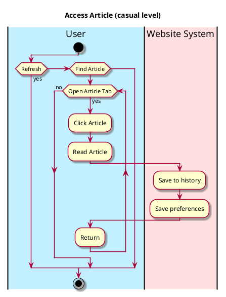

# Access Article 

## 1. Primary actor and goals
__User__: wants to obtain relevant articles on environment. Wants relevant, topical news and no outdated entries. Wants to read news in a readable format, with togglable display settings

## 2. Other stakeholders and their goals

* __Websites__: Want credits and attribution of original article. Want their page linked on hub. Want to attract readers. 
* __Author__: Wants credit for authoring article. Wants views, upvotes, and ratings on article.

## 3. Preconditions
* User is authenticated.
* User is in the Article hub tab.

## 4. Postconditions
For _access article_:

* Article is saved to history.
* Tags are added to user preference
* Points are calculated and added to score after user finishes reading.
* Other articles are recommended.

## 5. Workflow

The sequence of steps involved in the execution of the use case, in the form of one or more activity diagrams (please feel free to decompose into multiple diagrams for readability).

The workflow can be specified at different levels of detail:

* __Brief__: main success scenario only;
* __Casual__: most common scenarios and variations;
* __Fully-dressed__: all scenarios and variations.

Please be sure indicate what level of detail the workflow you include represents. 

For example, for _access-article_:

