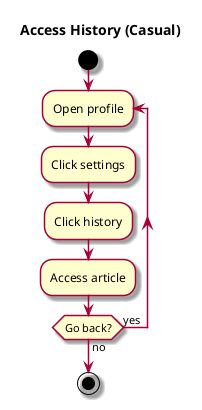

# Access History

## 1. Primary actor and goals

__User__: Wants to look through previous articles read. Wants easy access to react, or reread article.

## 2. Other stakeholders and their goals

* No other stakeholders.

## 3. Preconditions

* User switches to view profile tab.
* User clicks settings tab.

## 4. Postconditions

* History is accessed and user knows which articles they have read.

## 5. Workflow

The sequence of steps involved in the execution of the use case, in the form of one or more activity diagrams (please feel free to decompose into multiple diagrams for readability).

The workflow can be specified at different levels of detail:

* __Brief__: main success scenario only;
* __Casual__: most common scenarios and variations;
* __Fully-dressed__: all scenarios and variations.

Please be sure indicate what level of detail the workflow you include represents.

For example, for _process sale_:

