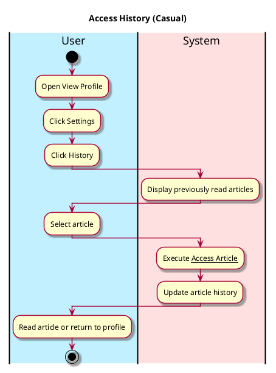

# Access History

## 1. Primary actor and goals

__User__: Wants to look through previous articles that they have read. Ease of access rereading articles, accessing history, and previous reactions

## 2. Other stakeholders and their goals
* No other stakeholders.

## 3. Preconditions
* User is authenticated
* User switches to view profile tab.
* User clicks settings tab.

## 4. Postconditions
* History is accessed and user knows which articles they have read.
* User is able to access an article from the history tab

## 5. Workflow
