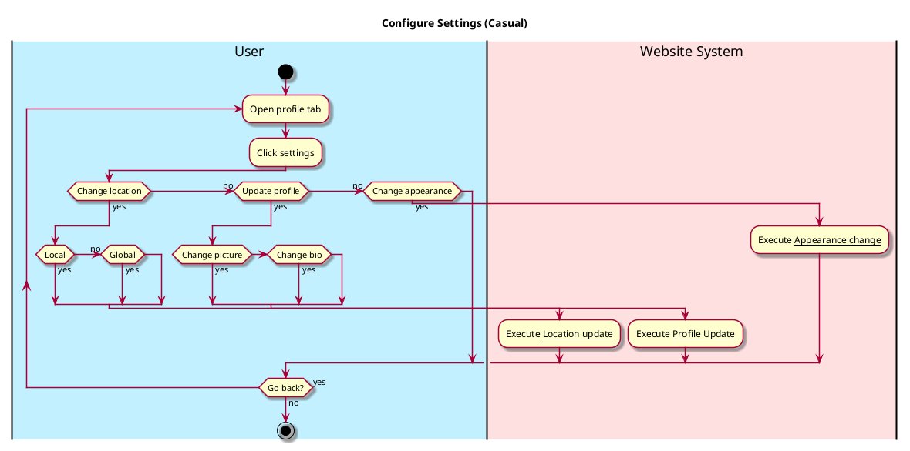

# Configure Settings

## 1. Primary actor and goals
Who is the main interested party and what goal(s) this use case is designed to help them achieve. For example, for _process sale_:

__User__: Wants to change location settings, either local or global. Wants to change appearance of app. Wants to view and/or change any other relevant account information.

## 2. Other stakeholders and their goals

## 3. Preconditions

* User is in Profile tab.
* User has clicked settings button.

## 4. Postconditions
For _configure-settings_:

* Profile/account information may be updated.
* Location information may be toggled.
* Appearance may be changed.

## 5. Workflow

The sequence of steps involved in the execution of the use case, in the form of one or more activity diagrams (please feel free to decompose into multiple diagrams for readability).

The workflow can be specified at different levels of detail:

* __Brief__: main success scenario only;
* __Casual__: most common scenarios and variations;
* __Fully-dressed__: all scenarios and variations.

Please be sure indicate what level of detail the workflow you include represents.

For example, for _process sale_:

