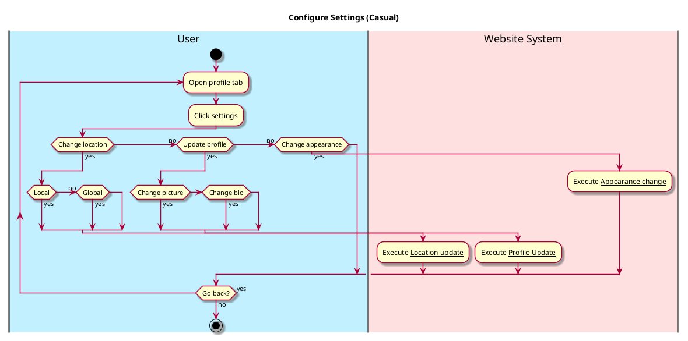

# Configure Settings

## 1. Primary actor and goals
__User__: Wants to change location settings, either local or global. Wants to change appearance of app. Wants to view and/or change any other relevant account information.

## 2. Other stakeholders and their goals
No other stakeholders

## 3. Preconditions
* User is in Profile tab.
* User has clicked settings button.

## 4. Postconditions

* Profile/account information may be updated.
* Location information may be toggled.
* Appearance may be changed.

## 5. Workflow
