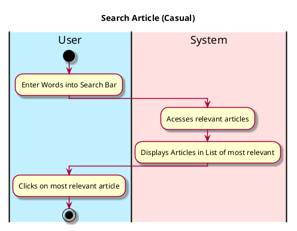

# React Article

## 1. Primary actor and goals
__User__: Wants to react (like, comment) on an article and have said reaction be shown.

## 2. Other stakeholders and their goals

* __Websites__: Wants to know how many reactions the article has gotten for later use
* __Author__: Wants to know how many reactions the article has gotten and how many people like/disliked or commented on their article

## 3. Preconditions

* User opens EcoScoop
* User switches to Article Section
* User has read the article
* User has clicked a react option

## 4. Postconditions

* Took in user input of reaction
* Displays reaction (comment or like/dislike)

## 5. Workflow

