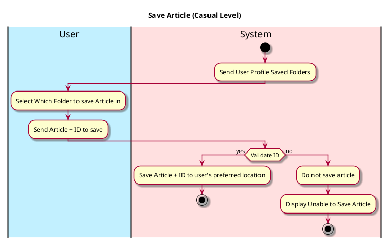

# Save Article

## 1. Primary actor and goals

__User__: Wants to save article for later viewing or to organize into a folder. Wants to be able to easily access saved articles. 

## 2. Other stakeholders and their goals

* __Author__: Wants to know how many saves their article has gained.

## 3. Preconditions

* User opens EcoScoop
* User switches to Article Section
* User accesses Article
* User has clicked Save Article Button

## 4. Postconditions
* Stores Article into a Saved Folder

## 5. Workflow

