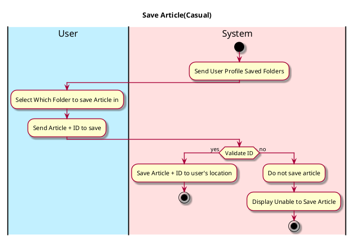

# Save Article

## 1. Primary actor and goals

__User__: Wants to save article for later viewing or to organize into a folder. Wants to be able to easily access saved articles. 

## 2. Other stakeholders and their goals

* __Author__: Wants to know how many saves their article has gained.

## 3. Preconditions

For _save-article_:

* User opens EcoScoop
* User switches to Article Section
* User Accessed Article
* User has clicked Save Article Button

## 4. Postconditions

For _save-article_:

* List of relevant articles are shown
* Ordered from most relevant

## 5. Workflow

The sequence of steps involved in the execution of the use case, in the form of one or more activity diagrams (please feel free to decompose into multiple diagrams for readability).

The workflow can be specified at different levels of detail:

* __Brief__: main success scenario only;
* __Casual__: most common scenarios and variations;
* __Fully-dressed__: all scenarios and variations.

Please be sure indicate what level of detail the workflow you include represents.

For example, for _save-article_:

