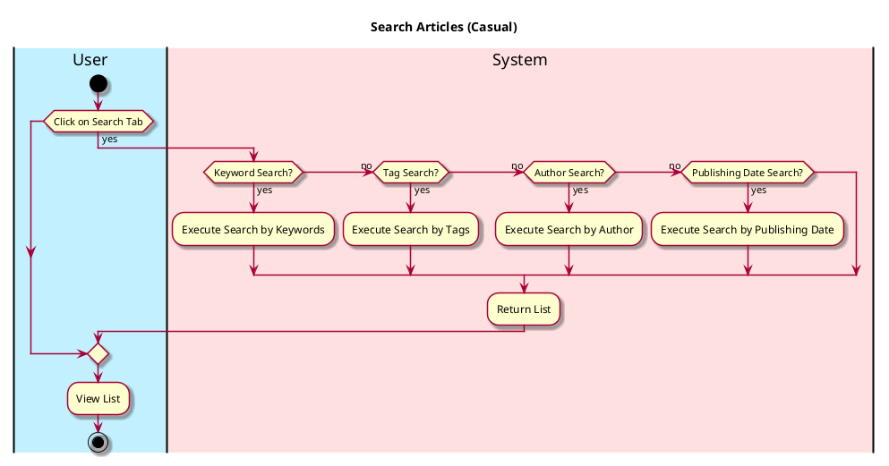

# Search Article

## 1. Primary actor and goals
__User__: Wants to look for relevant articles depending on keywords, tags, authors, or publishing year. Looking for relevant, topical news that all relate to what the user inputs and is searching for.

## 2. Other stakeholders and their goals

* __Websites__: Want credits and attribution of original article. Want their page linked on hub. Want to attract readers.
* __Author__: Wants credit for authoring article. Wants views, upvotes, and ratings on article.

## 3. Preconditions

* User opens EcoScoop
* User switches to Article Section

## 4. Postconditions

* List of relevant articles are shown
* Ordered from most relevant based on relevancy from keywords
## 5. Workflow

* __Brief__: main success scenario only;
* __Casual__: most common scenarios and variations;
* __Fully-dressed__: all scenarios and variations.

Please be sure indicate what level of detail the workflow you include represents.

For example, for _process sale_:

