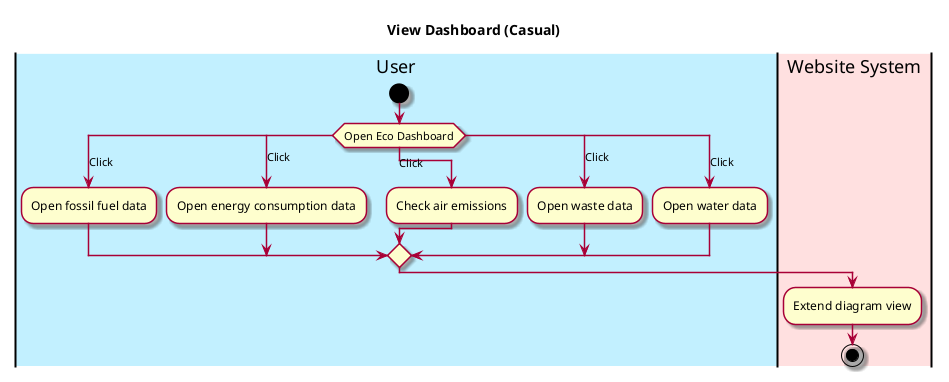

# View Eco Dashboard

## 1. Primary actor and goals

__User__: Wants to access quick, relevant info on sustainability stats and current information on the environment. Wants to be able to read the charts and click on them for more interactivity.

## 2. Other stakeholders and their goals

* __Sources__: Want credit for data used.

## 3. Preconditions

What must be true prior to the start of the use case.
For example, for _view-dashboard_:

* Daily information has been compressed into easily digestible graphics.
* User has opened the app or switched back into Eco Dashboard tab.

## 4. Postconditions

What must be true upon successful completion of the use case.
For example, for _view-dashboard_:

* User has quick and easy access to stats.

## 5. Workflow

The sequence of steps involved in the execution of the use case, in the form of one or more activity diagrams (please feel free to decompose into multiple diagrams for readability).

The workflow can be specified at different levels of detail:

* __Brief__: main success scenario only;
* __Casual__: most common scenarios and variations;
* __Fully-dressed__: all scenarios and variations.

Please be sure indicate what level of detail the workflow you include represents.

For example, for _view-dashboard_:

