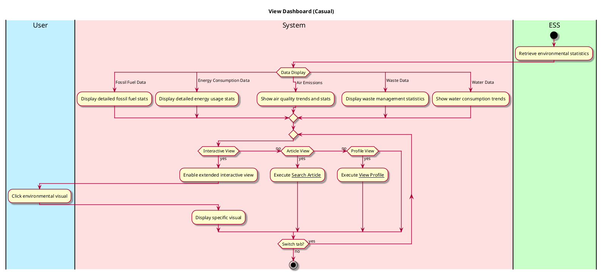

# View Eco Dashboard

## 1. Primary actor and goals

__User__: Wants to access quick, relevant info on sustainability stats and current information on the environment. Wants to be able to read the charts and click on them for more interactivity.

## 2. Other stakeholders and their goals

* __Sources__: Want credit for data used.

## 3. Preconditions

* Daily information has been compressed into easily digestible graphics.
* User has opened the app or switched back into Eco Dashboard tab.

## 4. Postconditions

* User has quick and easy access to stats.
* User is able to switch data interactive view until satisfied.

## 5. Workflow

