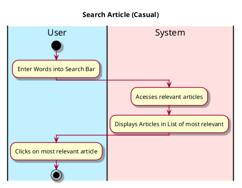

# View Profile

## 1. Primary actor and goals
__User__: Wants to look for relevant articles depending on keywords and other searches. Looking for relevant, topical news that all relate to what the user inputs and is searching for.

## 2. Other stakeholders and their goals
No other stakeholders

## 3. Preconditions

* User opens EcoScoop
* User switches to Profile Section

## 4. Postconditions

* Displays the User Profile
* Displays Level/Gamified Aspects

## 5. Workflow

The sequence of steps involved in the execution of the use case, in the form of one or more activity diagrams (please feel free to decompose into multiple diagrams for readability).

The workflow can be specified at different levels of detail:

* __Brief__: main success scenario only;
* __Casual__: most common scenarios and variations;
* __Fully-dressed__: all scenarios and variations.

Please be sure indicate what level of detail the workflow you include represents.

For example, for _process sale_:

