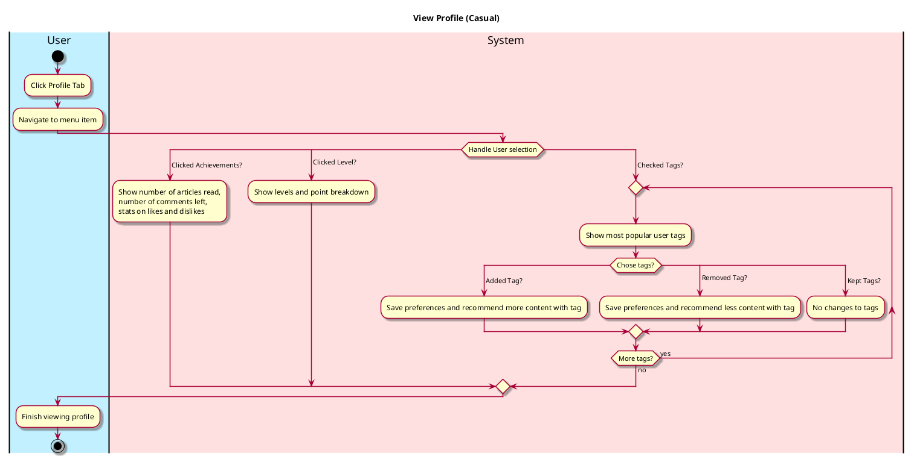

# View Profile

## 1. Primary actor and goals
__User__: Wants to check achievements, access stats and points, change bio, review tags. Wants clear direction of what to access.

## 2. Other stakeholders and their goals
No other stakeholders

## 3. Preconditions

* User opens EcoScoop
* User switches to Profile Section

## 4. Postconditions

* Displays the User Profile
* Displays Level/Gamified Aspects
* Shows Likes and Tags.

## 5. Workflow

