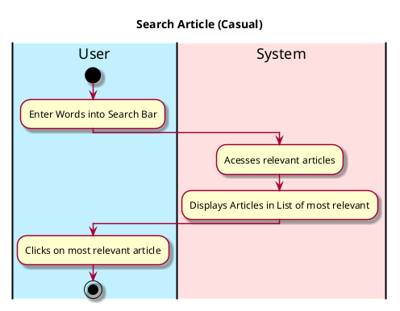

# View Profile

## 1. Primary actor and goals
Who is the main interested party and what goal(s) this use case is designed to help them achieve. For example, for _process sale_:

__User__: Wants to look for relevant articles depending on keywords and other searches. Looking for relevant, topical news that all relate to what the user inputs and is searching for.

## 2. Other stakeholders and their goals

* __Websites__: Want credits and attribution of original article. Want their page linked on hub. Want to attract readers.
* __Author__: Wants credit for authoring article. Wants views, upvotes, and ratings on article.

## 3. Preconditions

What must be true prior to the start of the use case.
For example, for _process sale_:

* User opens EcoScoop
* User switches to Article Section
* User clicks the search icon

## 4. Postconditions

What must be true upon successful completion of the use case.
For example, for _process sale_:

* List of relevant articles are shown
* Ordered from most relevant

## 5. Workflow

The sequence of steps involved in the execution of the use case, in the form of one or more activity diagrams (please feel free to decompose into multiple diagrams for readability).

The workflow can be specified at different levels of detail:

* __Brief__: main success scenario only;
* __Casual__: most common scenarios and variations;
* __Fully-dressed__: all scenarios and variations.

Please be sure indicate what level of detail the workflow you include represents.

For example, for _process sale_:

