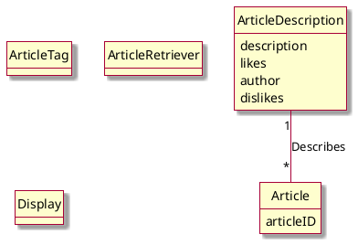

```plantuml
@startuml
skin rose
hide circle
hide empty methods

'classes
class ArticleDescription{
    description
    likes
    author
    dislikes
}

class ArticleTag{

}

class Article{
    articleID
}

class ArticleRetriever{
    
}

class Display {
}


' associations 
ArticleDescription "1" -- "*" Article :Describes

'Systems

@enduml
```