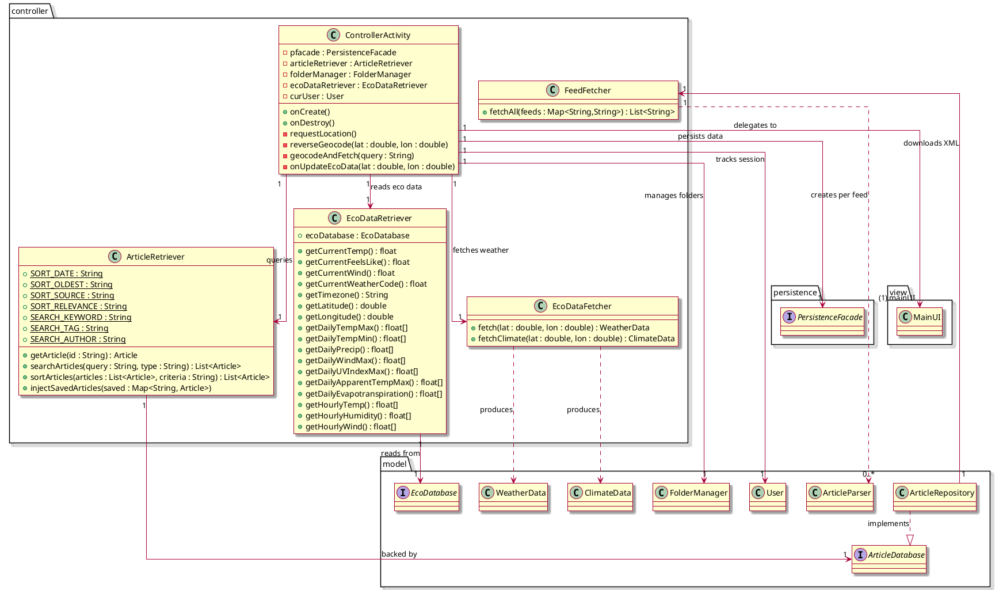
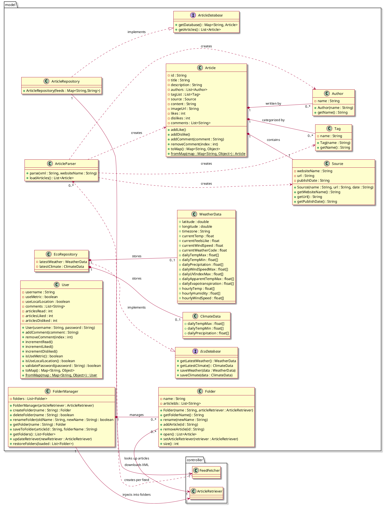
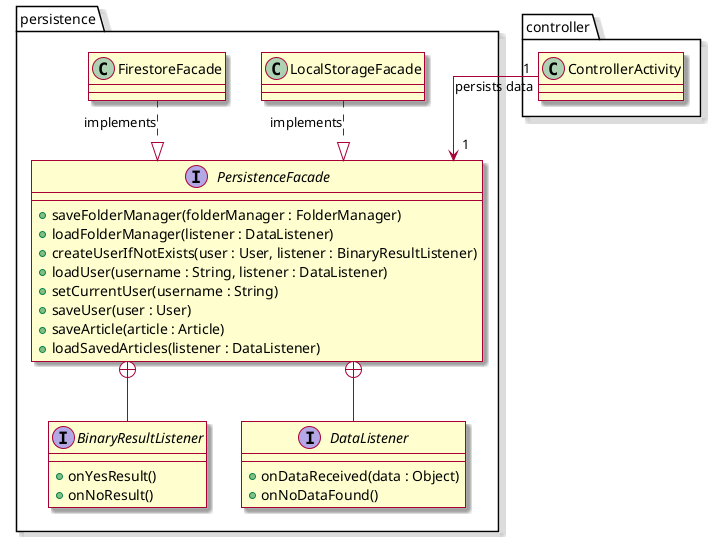

# Class Diagrams

## View Layer

```plantuml
@startuml
skin rose
skinparam linetype ortho

together {
  interface view.AuthUI {
    + setListener(listener : AuthUIListener)
    + onRegisterSuccess()
    + onInvalidCredentials()
    + onUserAlreadyExists()
  }
  interface view.AuthUIListener {
    + onRegister(username : String, password : String, ui : AuthUI)
    + onSigninAttempt(username : String, password : String, ui : AuthUI)
  }
}

together {
  interface view.ArticleFeedUI {
    + setListener(listener : ArticleFeedUIListener)
    + runShowFeed(articleList : List<Article>)
    + runArticleClicked(id : String)
  }
  interface view.ArticleFeedUIListener {
    + onArticleTabClick()
    + onDashBoardClick()
    + onSearchClick()
    + onProfileClick()
    + onArticleClicked(id : String)
    + onShowFeed(articleList : List<Article>, ui : ArticleFeedUI)
  }
}

together {
  interface view.SearchArticleUI {
    + setListener(listener : SearchArticleUIListener)
    + runShowResults(results : List<Article>)
    + runShowFreshResults(results : List<Article>)
  }
  interface view.SearchArticleUIListener {
    + onSearchQuery(query : String, type : String, ui : SearchArticleUI)
    + onSortResults(results : List<Article>, criteria : String, ui : SearchArticleUI)
    + onArticleClicked(id : String)
    + onArticleTabClick()
    + onDashBoardClick()
    + onProfileClick()
  }
}

together {
  interface view.DisplayArticleUI {
    + setListener(listener : DisplayArticleUIListener)
    + runShowArticle(article : Article)
  }
  interface view.DisplayArticleUIListener {
    + onReturnClick()
    + onArticleTabClick()
    + onDashBoardClick()
    + onSearchClick()
    + onProfileClick()
    + onRequestArticle(id : String, ui : DisplayArticleUI)
    + onSaveClick(id : String, folderName : String)
    + onLikeClick(id : String)
    + onDislikeClick(id : String)
    + onCommentSubmit(id : String, comment : String)
  }
}

together {
  interface view.DashboardUI {
    + setListener(listener : DashboardUIListener)
    + onWeatherLoaded(retriever : EcoDataRetriever)
  }
  interface view.DashboardUIListener {
    + onArticleTabClick()
    + onSearchClick()
    + onProfileClick()
    + onRequestGPSRefresh()
    + onSearchLocation(query : String)
  }
}

together {
  interface view.ProfileUI {
    + setListener(listener : ProfileUIListener)
  }
  interface view.ProfileUIListener {
    + onGetFolders() : List<Folder>
    + onGetFolderContents(folderName : String) : List<Article>
    + onGetUserComments() : List<String>
    + onRemoveComment(index : int)
    + onArticleClicked(id : String)
    + onDeleteFolder(folderName : String)
    + onRenameFolder(oldName : String, newName : String)
    + onRemoveArticle(folderName : String, articleId : String)
    + onSettingChanged(useMetric : boolean, useLocalLocation : boolean)
    + getUserSettingMetric() : boolean
    + getUserSettingLocal() : boolean
    + getUserStats() : int[]
    + onArticleTabClick()
    + onDashBoardClick()
    + onSearchClick()
  }
}

together {
  class view.AuthFragment {
    - binding : FragmentAuthBinding
    - listener : AuthUIListener
    - isRegistered : boolean
  }
  class view.ArticleFeedFragment {
    - binding : FragmentArticleFeedBinding
    - listener : ArticleFeedUIListener
    - articleFeedAdapter : ArticleFeedAdapter
  }
  class view.SearchArticleFragment {
    - binding : FragmentSearchArticleBinding
    - listener : SearchArticleUIListener
    - currentResults : List<Article>
    - originalResults : List<Article>
  }
  class view.DisplayArticleFragment {
    - binding : FragmentDisplayArticleBinding
    - listener : DisplayArticleUIListener
  }
  class view.DashboardFragment {
    - binding : FragmentDashboardBinding
    - listener : DashboardUIListener
    - pendingRetriever : EcoDataRetriever
    - useMetric : boolean
    + setLocationLabel(label : String)
    + setUseMetric(useMetric : boolean)
  }
  class view.ProfileFragment {
    - binding : FragmentProfileBinding
    - listener : ProfileUIListener
  }
}

class view.MainUI {
  - binding : ActivityMainBinding
  - fmanager : FragmentManager
  + MainUI(factivity : FragmentActivity)
  + displayFragment(frag : Fragment)
  + getRootView() : View
}


class controller.ControllerActivity

AuthFragment          ..|> AuthUI : implements
ArticleFeedFragment   ..|> ArticleFeedUI : implements
SearchArticleFragment ..|> SearchArticleUI : implements
DisplayArticleFragment ..|> DisplayArticleUI : implements
DashboardFragment     ..|> DashboardUI : implements
ProfileFragment       ..|> ProfileUI : implements

ControllerActivity ..|> AuthUIListener : implements
ControllerActivity ..|> ArticleFeedUIListener : implements
ControllerActivity ..|> SearchArticleUIListener : implements
ControllerActivity ..|> DisplayArticleUIListener : implements
ControllerActivity ..|> DashboardUIListener : implements
ControllerActivity ..|> ProfileUIListener : implements

ControllerActivity "1" --> "(1) mainUI" MainUI : delegates to
AuthUIListener          "0..1" -- "1" AuthFragment
ArticleFeedUIListener   "0..1" -- "1" ArticleFeedFragment
SearchArticleUIListener "0..1" -- "1" SearchArticleFragment
DisplayArticleUIListener "0..1" -- "1" DisplayArticleFragment
DashboardUIListener     "0..1" -- "1" DashboardFragment
ProfileUIListener       "0..1" -- "1" ProfileFragment

@enduml
```

## Controller Layer

```plantuml
@startuml
skin rose
skinparam linetype ortho

class controller.ControllerActivity {
  - pfacade : PersistenceFacade
  - articleRetriever : ArticleRetriever
  - folderManager : FolderManager
  - ecoDataRetriever : EcoDataRetriever
  - curUser : User
  + onCreate()
  + onDestroy()
  - requestLocation()
  - reverseGeocode(lat : double, lon : double)
  - geocodeAndFetch(query : String)
  - onUpdateEcoData(lat : double, lon : double)
}

class controller.ArticleRetriever {
  {static} + SORT_DATE : String
  {static} + SORT_OLDEST : String
  {static} + SORT_SOURCE : String
  {static} + SORT_RELEVANCE : String
  {static} + SEARCH_KEYWORD : String
  {static} + SEARCH_TAG : String
  {static} + SEARCH_AUTHOR : String
  + getArticle(id : String) : Article
  + searchArticles(query : String, type : String) : List<Article>
  + sortArticles(articles : List<Article>, criteria : String) : List<Article>
  + injectSavedArticles(saved : Map<String, Article>)
}

class controller.EcoDataRetriever {
  + ecoDatabase : EcoDatabase
  + getCurrentTemp() : float
  + getCurrentFeelsLike() : float
  + getCurrentWind() : float
  + getCurrentWeatherCode() : float
  + getTimezone() : String
  + getLatitude() : double
  + getLongitude() : double
  + getDailyTempMax() : float[]
  + getDailyTempMin() : float[]
  + getDailyPrecip() : float[]
  + getDailyWindMax() : float[]
  + getDailyUVIndexMax() : float[]
  + getDailyApparentTempMax() : float[]
  + getDailyEvapotranspiration() : float[]
  + getHourlyTemp() : float[]
  + getHourlyHumidity() : float[]
  + getHourlyWind() : float[]
}

class controller.EcoDataFetcher {
  + fetch(lat : double, lon : double) : WeatherData
  + fetchClimate(lat : double, lon : double) : ClimateData
}

class controller.FeedFetcher {
  + fetchAll(feeds : Map<String,String>) : List<String>
}

together {
  interface model.ArticleDatabase
  class model.ArticleRepository
  class model.ArticleParser
}

together {
  class model.FolderManager
  class model.User
}

together {
  interface model.EcoDatabase
  class model.WeatherData
  class model.ClimateData
}

interface persistence.PersistenceFacade
class view.MainUI

controller.ControllerActivity "1" --> "1" controller.ArticleRetriever : queries
controller.ControllerActivity "1" --> "1" model.FolderManager : manages folders
controller.ControllerActivity "1" --> "1" controller.EcoDataRetriever : reads eco data
controller.ControllerActivity "1" --> "1" model.User : tracks session
controller.ControllerActivity "1" --> "1" controller.EcoDataFetcher : fetches weather
controller.ControllerActivity "1" --> "1" persistence.PersistenceFacade : persists data
controller.ControllerActivity "1" --> "(1) mainUI" view.MainUI : delegates to

controller.ArticleRetriever "1" --> "1" model.ArticleDatabase : backed by
model.ArticleRepository ..|> model.ArticleDatabase : implements
model.ArticleRepository "1" --> "1" controller.FeedFetcher : downloads XML
controller.FeedFetcher "1" ..> "0..*" model.ArticleParser : creates per feed

controller.EcoDataRetriever "1" --> "1" model.EcoDatabase : reads from
controller.EcoDataFetcher ..> model.WeatherData : produces
controller.EcoDataFetcher ..> model.ClimateData : produces

@enduml
```

## Model Layer

```plantuml
@startuml
skin rose
left to right direction

interface model.ArticleDatabase {
  + getDatabase() : Map<String, Article>
  + getArticles() : List<Article>
}

class model.ArticleRepository {
  + ArticleRepository(feeds : Map<String,String>)
}

class controller.FeedFetcher

class model.ArticleParser {
  + parse(xml : String, websiteName : String)
  + loadArticles() : List<Article>
}

class model.Article {
  - id : String
  - title : String
  - description : String
  - authors : List<Author>
  - tagList : List<Tag>
  - source : Source
  - content : String
  - imageUrl : String
  - likes : int
  - dislikes : int
  - comments : List<String>
  + addLike()
  + addDislike()
  + addComment(comment : String)
  + removeComment(index : int)
  + toMap() : Map<String, Object>
  {static} + fromMap(map : Map<String, Object>) : Article
}

together {
  class model.Author {
    - name : String
    + Author(name : String)
    + getName() : String
  }
  class model.Tag {
    - name : String
    + Tag(name : String)
    + getName() : String
  }
  class model.Source {
    - websiteName : String
    - url : String
    - publishDate : String
    + Source(name : String, url : String, date : String)
    + getWebsiteName() : String
    + getUrl() : String
    + getPublishDate() : String
  }
}

class controller.ArticleRetriever

class model.FolderManager {
  - folders : List<Folder>
  + FolderManager(articleRetriever : ArticleRetriever)
  + createFolder(name : String) : Folder
  + deleteFolder(name : String) : boolean
  + renameFolder(oldName : String, newName : String) : boolean
  + getFolder(name : String) : Folder
  + saveToFolder(articleId : String, folderName : String)
  + getFolders() : List<Folder>
  + updateRetriever(newRetriever : ArticleRetriever)
  + restoreFolders(loaded : List<Folder>)
}

class model.Folder {
  - name : String
  - articleIds : List<String>
  + Folder(name : String, articleRetriever : ArticleRetriever)
  + getFolderName() : String
  + rename(newName : String)
  + addArticle(id : String)
  + removeArticle(id : String)
  + open() : List<Article>
  + setArticleRetriever(retriever : ArticleRetriever)
  + size() : int
}

class model.User {
  - username : String
  - useMetric : boolean
  - useLocalLocation : boolean
  - comments : List<String>
  - articlesRead : int
  - articlesLiked : int
  - articlesDisliked : int
  + User(username : String, password : String)
  + addComment(comment : String)
  + removeComment(index : int)
  + incrementRead()
  + incrementLiked()
  + incrementDisliked()
  + isUseMetric() : boolean
  + isUseLocalLocation() : boolean
  + validatePassword(password : String) : boolean
  + toMap() : Map<String, Object>
  {static} + fromMap(map : Map<String, Object>) : User
}

interface model.EcoDatabase {
  + getLatestWeather() : WeatherData
  + getLatestClimate() : ClimateData
  + saveWeather(data : WeatherData)
  + saveClimate(data : ClimateData)
}

class model.EcoRepository {
  - latestWeather : WeatherData
  - latestClimate : ClimateData
}

together {
  class model.WeatherData {
    + latitude : double
    + longitude : double
    + timezone : String
    + currentTemp : float
    + currentFeelsLike : float
    + currentWindSpeed : float
    + currentWeatherCode : float
    + dailyTempMax : float[]
    + dailyTempMin : float[]
    + dailyPrecipitation : float[]
    + dailyWindSpeedMax : float[]
    + dailyUVIndexMax : float[]
    + dailyApparentTempMax : float[]
    + dailyEvapotranspiration : float[]
    + hourlyTemp : float[]
    + hourlyHumidity : float[]
    + hourlyWindSpeed : float[]
  }
  class model.ClimateData {
    + dailyTempMax : float[]
    + dailyTempMin : float[]
    + dailyPrecipitation : float[]
  }
}

model.ArticleRepository ..|> model.ArticleDatabase : implements
model.ArticleRepository "1" --> "1" controller.FeedFetcher : downloads XML
controller.FeedFetcher "1" ..> "0..*" model.ArticleParser : creates per feed
model.ArticleParser ..> model.Article : creates
model.ArticleParser ..> model.Author : creates
model.ArticleParser ..> model.Tag : creates
model.ArticleParser ..> model.Source : creates
model.Article "1" *-- "1"    model.Source : contains
model.Article "1" *-- "0..*" model.Author : written by
model.Article "1" *-- "0..*" model.Tag    : categorized by

' ── FOLDER ASSOCIATIONS ──────────────────────────────────────────────────────

model.FolderManager "1" *-- "0..*" model.Folder : manages
model.FolderManager "1" --> "1" controller.ArticleRetriever : injects into folders
model.Folder "0..*" --> "1" controller.ArticleRetriever : looks up articles

model.EcoRepository ..|> model.EcoDatabase : implements
model.EcoRepository "1" *-- "0..1" model.WeatherData : stores
model.EcoRepository "1" *-- "0..1" model.ClimateData : stores

@enduml
```

## Persistence Layer

```plantuml
@startuml
skin rose
skinparam linetype ortho

interface persistence.PersistenceFacade {
  + saveFolderManager(folderManager : FolderManager)
  + loadFolderManager(listener : DataListener)
  + createUserIfNotExists(user : User, listener : BinaryResultListener)
  + loadUser(username : String, listener : DataListener)
  + setCurrentUser(username : String)
  + saveUser(user : User)
  + saveArticle(article : Article)
  + loadSavedArticles(listener : DataListener)
}

together {
  interface persistence.DataListener {
    + onDataReceived(data : Object)
    + onNoDataFound()
  }
  interface persistence.BinaryResultListener {
    + onYesResult()
    + onNoResult()
  }
}

together {
  class persistence.LocalStorageFacade
  class persistence.FirestoreFacade
}

class controller.ControllerActivity

persistence.PersistenceFacade +-- persistence.DataListener
persistence.PersistenceFacade +-- persistence.BinaryResultListener
persistence.LocalStorageFacade ..|> persistence.PersistenceFacade : implements
persistence.FirestoreFacade    ..|> persistence.PersistenceFacade : implements
controller.ControllerActivity "1" --> "1" persistence.PersistenceFacade : persists data

@enduml
```
