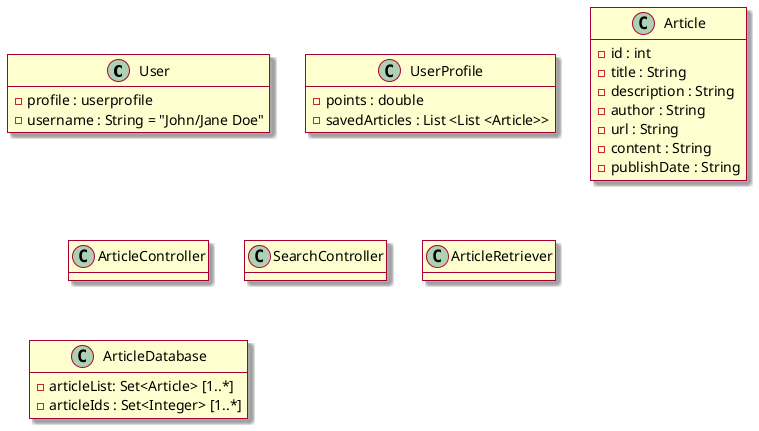

class ArticleDescription{
description
likes
author
dislikes
}

class Article{
title
content
publishDate
url
}

class ArticleTag{
name
}

class Author{
name
}

class Source{
name
url
}

class User{
userId
points
}

class ArticleInteraction{
reactionType
saved
}

class ArticleRetriever {
+getArticles()
+searchArticles()
}

class RecommendationService {
+recommendArticles(user)
}

class UserProgressService {
+updatePoints(user)
+saveInteraction(interaction)
}

' associations
ArticleDescription "1" -- "0..*" Article : describes
Author "1" -- "0..*" Article : writes
Source "1" -- "0..*" Article : publishes

Article "*" -- "*" ArticleTag : tagged with
class ArticleDescription{
description
likes
author
dislikes
}

class Article{
title
content
publishDate
url
}

class ArticleTag{
name
}

class Author{
name
}

class Source{
name
url
}

class User{
userId
points
}

class ArticleInteraction{
reactionType
saved
}

User "1" -- "0..*" ArticleInteraction : has
Article "1" -- "0..*" ArticleInteraction : involved in

User "*" -- "*" ArticleTag : prefers

'Systems
