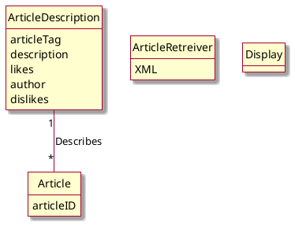

```plantuml
@startuml
skin rose
hide circle
hide empty methods

'classes
class ArticleDescription{
    articleTag
    description
    likes
    author
    dislikes
}

class Article{
    articleID
}

class ArticleRetreiver{
    XML
}

class Display {
}


' associations 
ArticleDescription "1" -- "*" Article :Describes

@enduml
```