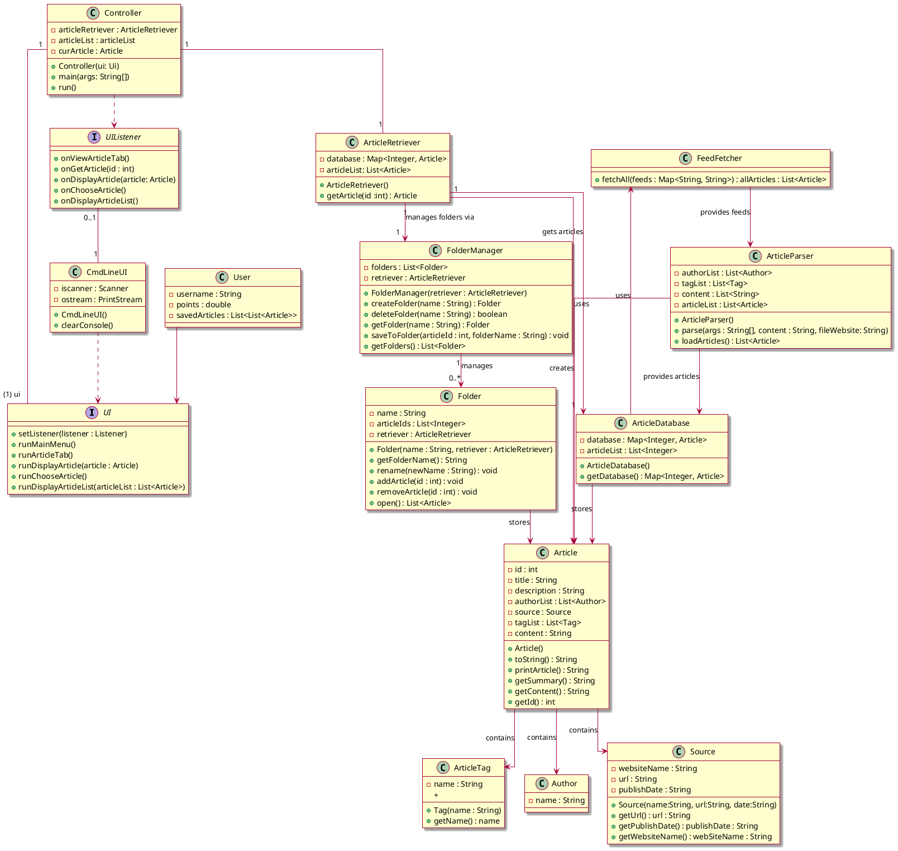

```plantuml
@startuml
skin rose
skinparam linetype ortho


interface UI{
  + setListener(listener : Listener)
  + runMainMenu()
  + runArticleTab()
  + runDisplayArticle(article : Article)
  + runChooseArticle()
  + runDisplayArticleList(articleList : List<Article>)
}

class CmdLineUI{
  - iscanner : Scanner
  - ostream : PrintStream
  + CmdLineUI()
  + clearConsole()
}

interface UIListener{
  + onViewArticleTab()
  + onGetArticle(id : int)
  + onDisplayArticle(article: Article)
  + onChooseArticle()
  + onDisplayArticleList()
}


class Controller {
  - articleRetriever : ArticleRetriever
  - articleList : articleList
  - curArticle : Article
  + Controller(ui: Ui)
  + main(args: String[])
  + run()
}

class ArticleRetriever {
  - database : Map<Integer, Article>
  - articleList: List<Article>
  + ArticleRetriever()
  + getArticle(id :int) : Article
  
  ' TODO: Extra Methods
  '+ submitSearch(query : String, type : String) : List<Article>
  '+ sortArticles(criteria : String) : List<Article>
  '+ getArticle(id : int) : Article
  '+ saveArticle(id : int) : void
  '+ calculatePoints() : double
  '+ recommendArticles() : List<Article>
  '+ displayArticle(id : int, content : String) : void
}

class FeedFetcher{
  + fetchAll(feeds : Map<String, String>) : allArticles : List<Article>
}

class ArticleParser {
  - authorList : List<Author>
  - tagList : List<Tag>
  - content : List<String>
  - articleList : List<Article>
  
  + ArticleParser()
  + parse(args : String[], content : String, fileWebsite: String)
  + loadArticles() : List<Article>
}

class ArticleDatabase {
  - database : Map<Integer, Article>
  - articleList : List<Integer>
  
  + ArticleDatabase()
  + getDatabase() : Map<Integer, Article>
}

class Article {
  - id : int
  - title : String
  - description : String
  - authorList : List<Author>
  - source : Source
  - tagList : List<Tag>
  - content : String
  + Article()
  + toString() : String
  + printArticle() : String
  + getSummary() : String
  + getContent() : String
  + getId() : int
}

class User {
  - username : String
  - points : double
  - savedArticles : List<List<Article>>
}

class FolderManager {
  - folders : List<Folder>
  - retriever : ArticleRetriever

  + FolderManager(retriever : ArticleRetriever)
  + createFolder(name : String) : Folder
  + deleteFolder(name : String) : boolean
  + getFolder(name : String) : Folder
  + saveToFolder(articleId : int, folderName : String) : void
  + getFolders() : List<Folder>
}

class Folder {
  - name : String
  - articleIds : List<Integer>
  - retriever : ArticleRetriever

  + Folder(name : String, retriever : ArticleRetriever)
  + getFolderName() : String
  + rename(newName : String) : void
  + addArticle(id : int) : void
  + removeArticle(id : int) : void
  + open() : List<Article>
}

class ArticleTag {
  - name : String
  + Tag(name : String)
  + getName() : name
  + 
  
}

class Author {
  - name : String
}

class Source {
  - websiteName : String
  - url : String
  - publishDate : String
  
  + Source(name:String, url:String, date:String)
  + getUrl() : url : String
  + getPublishDate() : publishDate : String
  + getWebsiteName() : webSiteName : String
}

'Front-End Associations
User --> UI
UIListener "0..1" -- "1" CmdLineUI
CmdLineUI ..> UI
Controller "1" -- "(1) ui" UI
Controller ..> UIListener

'Back-End Associations
Controller "1" -- "1" ArticleRetriever
ArticleRetriever "1" --> "1" ArticleDatabase : gets articles
ArticleRetriever "1" --> "1" FolderManager : manages folders via
FolderManager "1" --> "0..*" Folder : manages
ArticleParser --> ArticleDatabase : provides articles
FeedFetcher --> ArticleParser : provides feeds
FeedFetcher <-- ArticleDatabase : uses

ArticleRetriever --> Article : uses
ArticleDatabase --> Article : stores
ArticleParser --> Article : creates
Folder --> Article : stores
Article --> Source : contains
Article --> Author : contains
Article --> ArticleTag : contains


'Controller --> ArticleRetriever : delegates to
'ArticleRetriever --> ArticleDatabase : uses
'ArticleParser --> ArticleDatabase : updates
'ArticleDatabase "1" --> "0..*" Article : stores
'ArticleParser --> Article : creates
'ArticleRetriever --> Article : manages
'ArticleRetriever --> User : updates
'ArticleRetriever --> Folder : manages
'Author "1" --> "0..*" Article : writes
'Source "1" --> "0..*" Article : publishes
'Article "*" --> "*" ArticleTag : tagged with
'User "1" --> "0..*" Folder : owns
'User "*" --> "*" ArticleTag : prefers
'Folder "0..*" --> "*" Article : contains

@enduml
```
