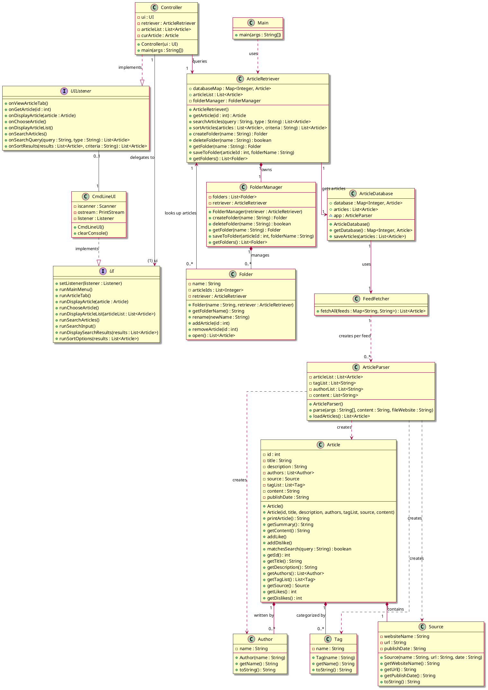

```plantuml
@startuml
skin rose
skinparam linetype ortho

interface UI {
  + setListener(listener : Listener)
  + runMainMenu()
  + runArticleTab()
  + runDisplayArticle(article : Article)
  + runChooseArticle()
  + runDisplayArticleList(articleList : List<Article>)
  + runSearchArticles()
  + runSearchInput()
  + runDisplaySearchResults(results : List<Article>)
  + runSortOptions(results : List<Article>)
}

class CmdLineUI {
  - iscanner : Scanner
  - ostream : PrintStream
  - listener : Listener
  + CmdLineUI()
  + clearConsole()
}

interface UIListener {
  + onViewArticleTab()
  + onGetArticle(id : int)
  + onDisplayArticle(article : Article)
  + onChooseArticle()
  + onDisplayArticleList()
  + onSearchArticles()
  + onSearchQuery(query : String, type : String) : List<Article>
  + onSortResults(results : List<Article>, criteria : String) : List<Article>
}

class Controller {
  - ui : UI
  - retriever : ArticleRetriever
  - articleList : List<Article>
  - curArticle : Article
  + Controller(ui : UI)
  + main(args : String[])
}

class ArticleRetriever {
  + databaseMap : Map<Integer, Article>
  + articleList : List<Article>
  - folderManager : FolderManager
  + ArticleRetriever()
  + getArticle(id : int) : Article
  + searchArticles(query : String, type : String) : List<Article>
  + sortArticles(articles : List<Article>, criteria : String) : List<Article>
  + createFolder(name : String) : Folder
  + deleteFolder(name : String) : boolean
  + getFolder(name : String) : Folder
  + saveToFolder(articleId : int, folderName : String)
  + getFolders() : List<Folder>
}

class ArticleDatabase {
  + database : Map<Integer, Article>
  + articles : List<Article>
  ~ app : ArticleParser
  + ArticleDatabase()
  + getDatabase() : Map<Integer, Article>
  + saveArticles(articles : List<Article>)
}

class FeedFetcher {
  + fetchAll(feeds : Map<String, String>) : List<Article>
}

class ArticleParser {
  - articleList : List<Article>
  - tagList : List<String>
  - authorList : List<String>
  - content : List<String>
  + ArticleParser()
  + parse(args : String[], content : String, fileWebsite : String)
  + loadArticles() : List<Article>
}

class Article {
  - id : int
  - title : String
  - description : String
  - authors : List<Author>
  - source : Source
  - tagList : List<Tag>
  - content : String
  - publishDate : String
  + Article()
  + Article(id, title, description, authors, tagList, source, content)
  + printArticle() : String
  + getSummary() : String
  + getContent() : String
  + addLike()
  + addDislike()
  + matchesSearch(query : String) : boolean
  + getId() : int
  + getTitle() : String
  + getDescription() : String
  + getAuthors() : List<Author>
  + getTagList() : List<Tag>
  + getSource() : Source
  + getLikes() : int
  + getDislikes() : int
}

class Author {
  - name : String
  + Author(name : String)
  + getName() : String
  + toString() : String
}

class Tag {
  - name : String
  + Tag(name : String)
  + getName() : String
  + toString() : String
}

class Source {
  - websiteName : String
  - url : String
  - publishDate : String
  + Source(name : String, url : String, date : String)
  + getWebsiteName() : String
  + getUrl() : String
  + getPublishDate() : String
  + toString() : String
}

class FolderManager {
  - folders : List<Folder>
  - retriever : ArticleRetriever
  + FolderManager(retriever : ArticleRetriever)
  + createFolder(name : String) : Folder
  + deleteFolder(name : String) : boolean
  + getFolder(name : String) : Folder
  + saveToFolder(articleId : int, folderName : String)
  + getFolders() : List<Folder>
}

class Folder {
  - name : String
  - articleIds : List<Integer>
  - retriever : ArticleRetriever
  + Folder(name : String, retriever : ArticleRetriever)
  + getFolderName() : String
  + rename(newName : String)
  + addArticle(id : int)
  + removeArticle(id : int)
  + open() : List<Article>
}

class Main {
  + main(args : String[])
}

' Front-End Associations
CmdLineUI ..|> UI : implements
Controller ..|> UIListener : implements
Controller "1" --> "(1) ui" UI : delegates to
UIListener "0..1" -- "1" CmdLineUI

' Back-End Associations
Controller "1" --> "1" ArticleRetriever : queries
ArticleRetriever "1" --> "1" ArticleDatabase : gets articles
ArticleDatabase "1" --> "1" FeedFetcher : uses
FeedFetcher "1" ..> "0..*" ArticleParser : creates per feed
ArticleParser ..> Article : creates
ArticleParser ..> Author : creates
ArticleParser ..> Tag : creates
ArticleParser ..> Source : creates

' Domain Associations
Article "1" *-- "1" Source : contains
Article "1" *-- "0..*" Author : written by
Article "1" *-- "0..*" Tag : categorized by

' Folder Associations
ArticleRetriever "1" *-- "1" FolderManager : owns
FolderManager "1" *-- "0..*" Folder : manages
Folder "0..*" --> "1" ArticleRetriever : looks up articles

' Test Harness
Main ..> ArticleRetriever : uses

@enduml
```
class-diagram.md
Displaying class-diagram.md.