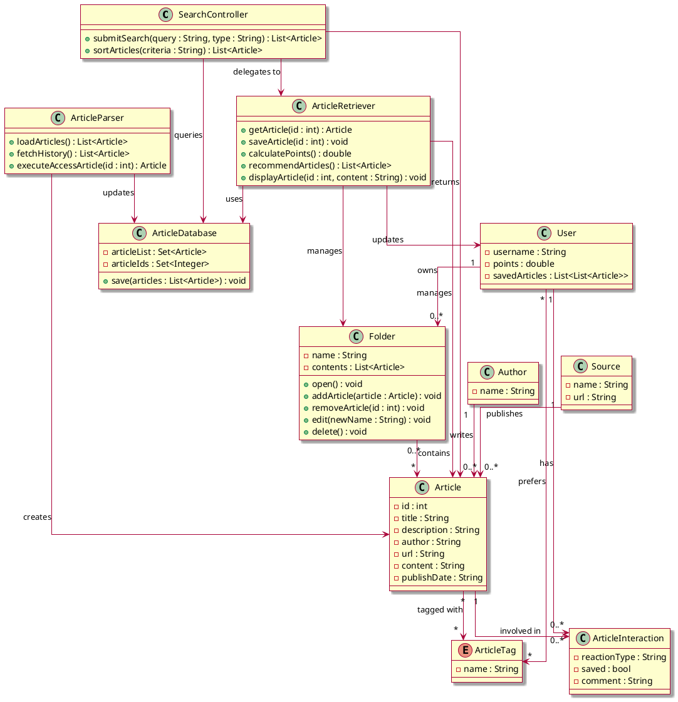

```plantuml
@startuml
skin rose
skinparam linetype ortho

class SearchController {
  + submitSearch(query : String, type : String) : List<Article>
  + sortArticles(criteria : String) : List<Article>
}

class ArticleRetriever {
  + getArticle(id : int) : Article
  + saveArticle(id : int) : void
  + calculatePoints() : double
  + recommendArticles() : List<Article>
  + displayArticle(id : int, content : String) : void
}

class ArticleParser {
  + loadArticles() : List<Article>
  + fetchHistory() : List<Article>
  + executeAccessArticle(id : int) : Article
}

class ArticleDatabase {
  - articleList : Set<Article>
  - articleIds : Set<Integer>
  + save(articles : List<Article>) : void
}

class Article {
  - id : int
  - title : String
  - description : String
  - author : String
  - url : String
  - content : String
  - publishDate : String
}

class User {
  - username : String
  - points : double
  - savedArticles : List<List<Article>>
}

class Folder {
  - name : String
  - contents : List<Article>
  + open() : void
  + addArticle(article : Article) : void
  + removeArticle(id : int) : void
  + edit(newName : String) : void
  + delete() : void
}

enum ArticleTag {
  - name : String
}

class ArticleInteraction {
  - reactionType : String
  - saved : bool
  - comment : String
}

class Author {
  - name : String
}

class Source {
  - name : String
  - url : String
}

SearchController --> ArticleRetriever : delegates to
SearchController --> ArticleDatabase : queries
ArticleRetriever --> ArticleDatabase : uses
ArticleParser --> ArticleDatabase : updates
ArticleParser --> Article : creates
ArticleRetriever --> Article : manages
ArticleRetriever --> User : updates
ArticleRetriever --> Folder : manages
SearchController --> Article : returns
Author "1" --> "0..*" Article : writes
Source "1" --> "0..*" Article : publishes
Article "*" --> "*" ArticleTag : tagged with
User "1" --> "0..*" ArticleInteraction : has
User "1" --> "0..*" Folder : owns
Article "1" --> "0..*" ArticleInteraction : involved in
User "*" --> "*" ArticleTag : prefers
Folder "0..*" --> "*" Article : contains

@enduml
```
