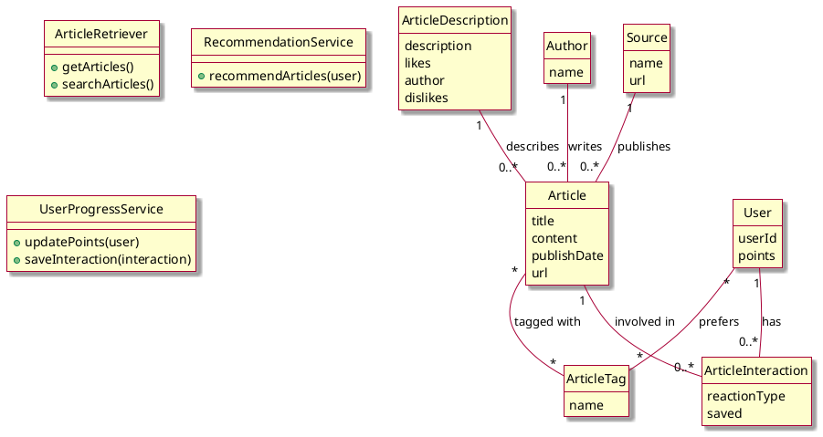

```plantuml
@startuml
skin rose
hide circle
hide empty methods

'classes
class ArticleDescription{
    description
    likes
    author
    dislikes
}

class Article{
    title
    content
    publishDate
    url
}

class ArticleTag{
    name
}

class Author{
    name
}

class Source{
    name
    url
}

class User{
   userId
   points
}

class ArticleInteraction{
    reactionType
    saved
}

class ArticleRetriever {
  +getArticles()
  +searchArticles()
}

class RecommendationService {
  +recommendArticles(user)
}

class UserProgressService {
  +updatePoints(user)
  +saveInteraction(interaction)
}


' associations 
ArticleDescription "1" -- "0..*" Article : describes
Author "1" -- "0..*" Article : writes
Source "1" -- "0..*" Article : publishes

Article "*" -- "*" ArticleTag : tagged with

User "1" -- "0..*" ArticleInteraction : has
Article "1" -- "0..*" ArticleInteraction : involved in

User "*" -- "*" ArticleTag : prefers

'Systems

@enduml
```