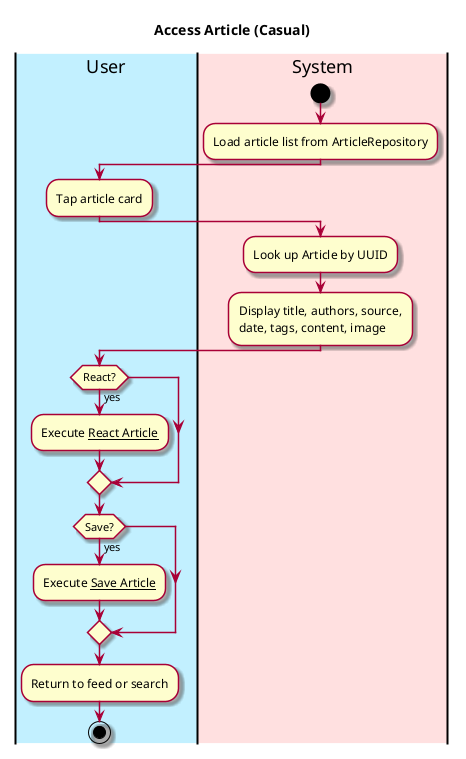
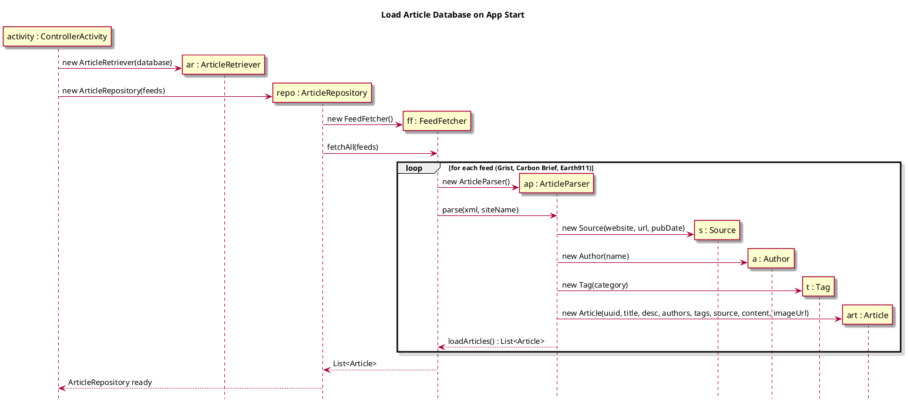
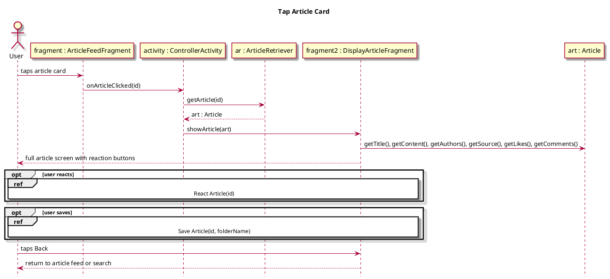

# Access Article

## 1. Primary actor and goals
__User__: Wants to read a full article, react to it, and optionally save it to a folder — all from a single screen.

## 2. Other stakeholders and their goals

* __Websites__: Require attribution. A link to the original article is shown.
* __Authors__: Require credit. Author names are displayed on the article screen.

## 3. Preconditions
* User is on the Article Feed or Search results screen and taps a card.

## 4. Postconditions
* Full article content is displayed.
* User may like/dislike, comment, or save the article.
* User can navigate back to the feed or search.

## 5. Workflow

## Sequence Diagrams

