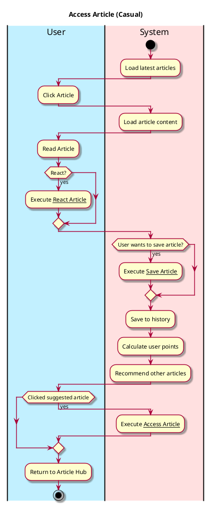
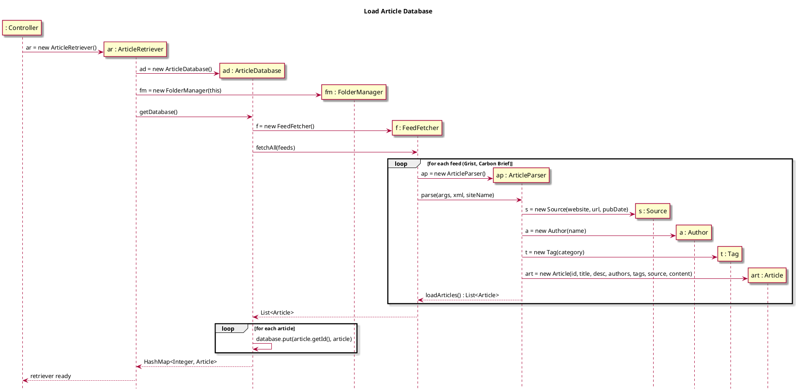
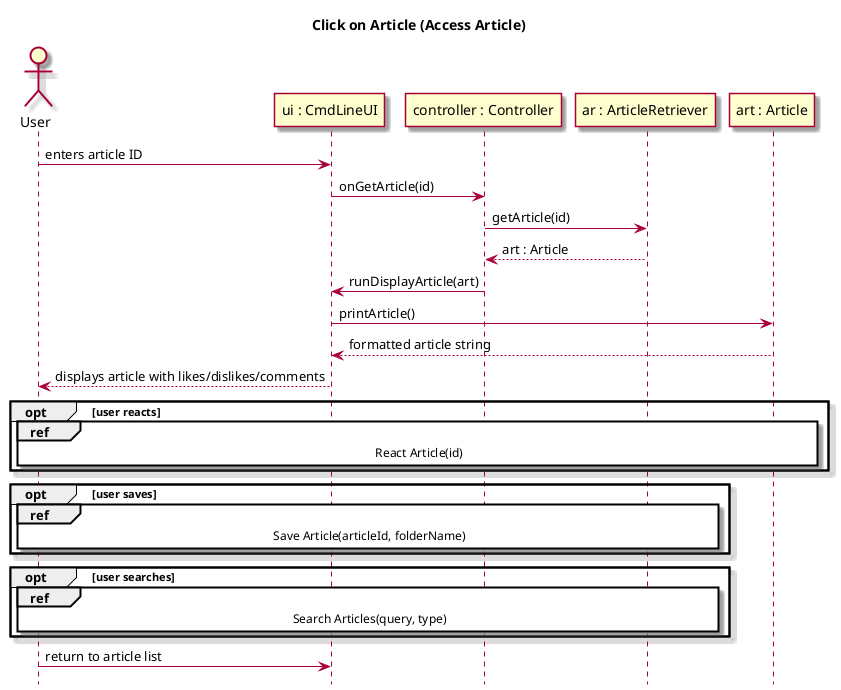

# Access Article 

## 1. Primary actor and goals
__User__: Wants ease of access obtaining relevant articles concerning environmental news. Desires relevant topical news and new entries. Ease of access concerning reading format, with toggleable reader/display settings.

## 2. Other stakeholders and their goals

* __Websites__: Require credit and attribution of original article. Wants links and references on the article page. Attracting readers to their website for more content.

* __Author__: Require credit and attribution for writing the article. Wants to be able to see s, upvotes, and other ratings on articles.

## 3. Preconditions
* User is in the Article tab or has searched for article.

## 4. Postconditions
* Article is saved to history.
* Tags are added to user preference
* Points are calculated and added to score after user finishes reading.
* Other articles are recommended.

## 5. Workflow

## Sequence Diagram - Load Article Database

## Sequence Diagram - Click on Article
