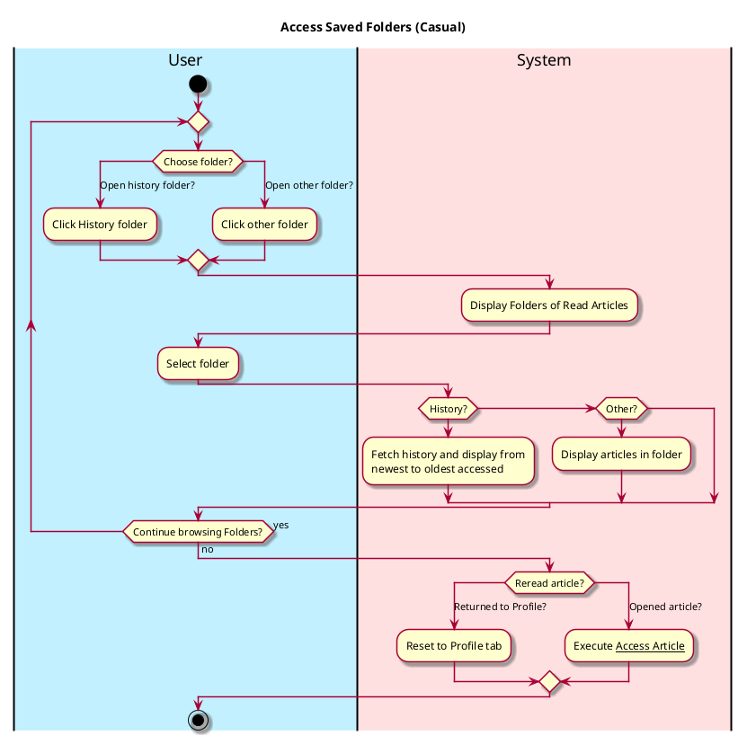
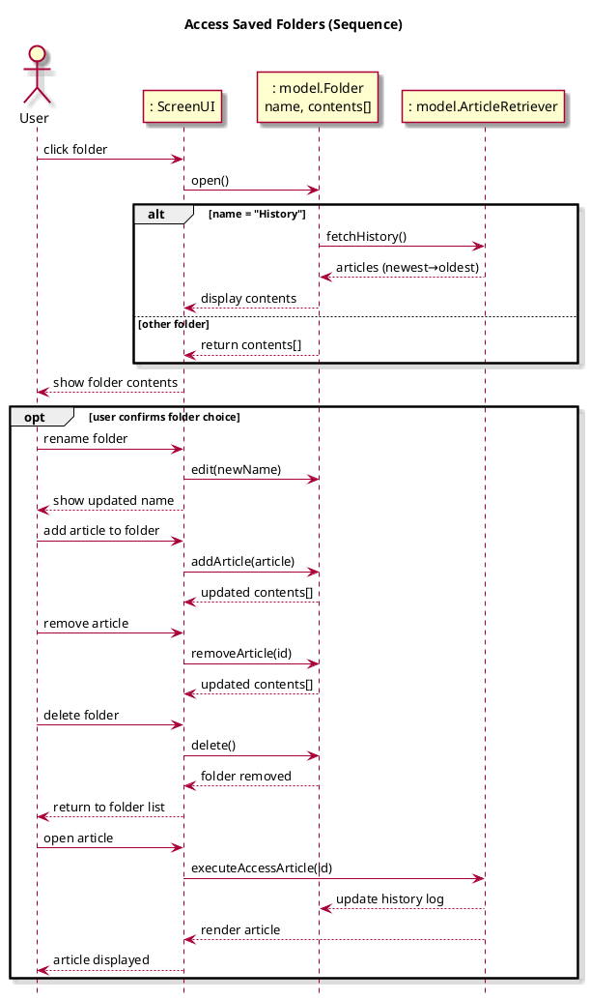

# Access Saved Folders

## 1. Primary actor and goals

__User__: Wants to look through previous articles that they have read or saved. Ease of access rereading articles, accessing history, and reviewing saved content.

## 2. Other stakeholders and their goals
* No other stakeholders.

## 3. Preconditions
* User is authenticated
* User switches to view profile tab.
* User clicks settings tab.
* User clicks saved folders tab.

## 4. Postconditions
* User has reviewed and/or accessed saved articles or history.
* When an article is accessed again, just as in the use case history is updated.

## 5. Workflow

## 6. Sequence Diagram
