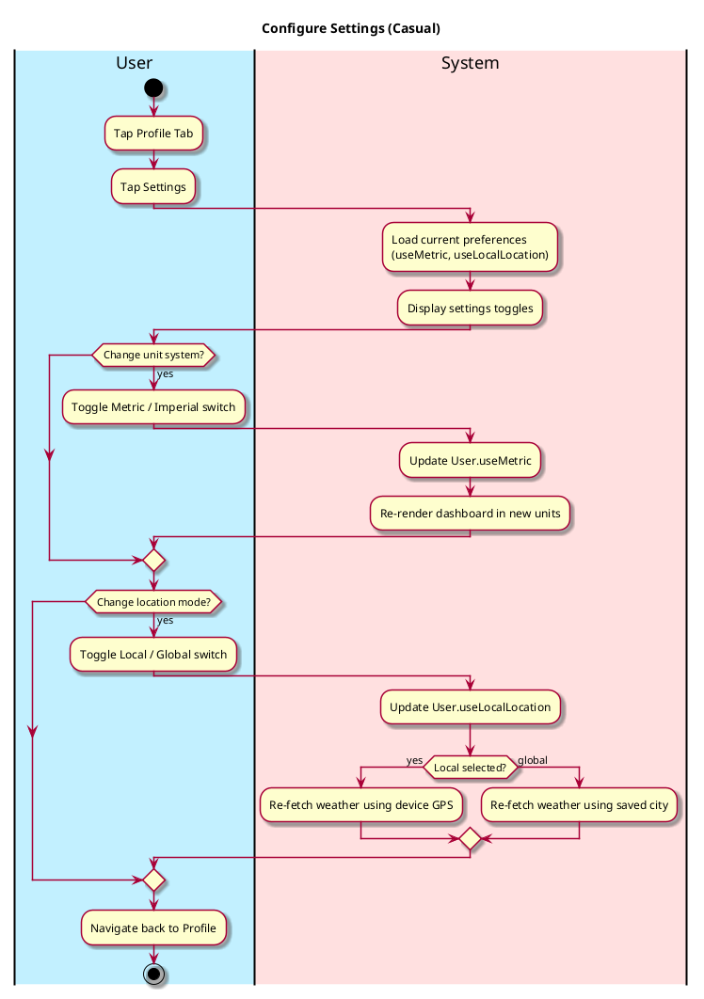
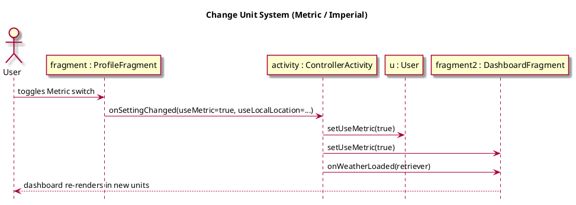
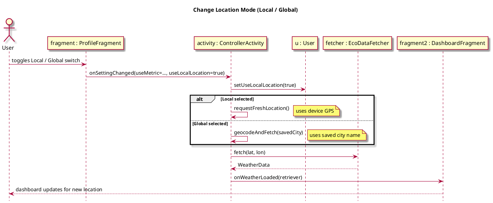

# Configure Settings

## 1. Primary actor and goals
__User__: Wants to change their unit preference (metric vs. imperial) and their location mode (use device GPS vs. a saved global city) from the Profile screen.

## 2. Other stakeholders and their goals
No other stakeholders.

## 3. Preconditions
* User is authenticated.
* User is on the Profile tab.

## 4. Postconditions
* Unit system preference is saved to the User model and the dashboard re-renders in the selected units.
* Location mode preference is saved to the User model and the dashboard re-fetches weather for the appropriate location.

## 5. Workflow

## 6. Sequence Diagrams

