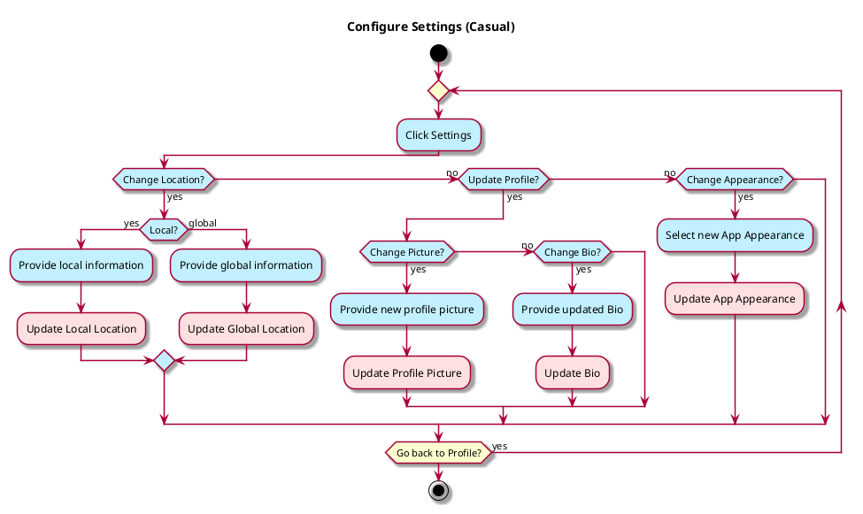
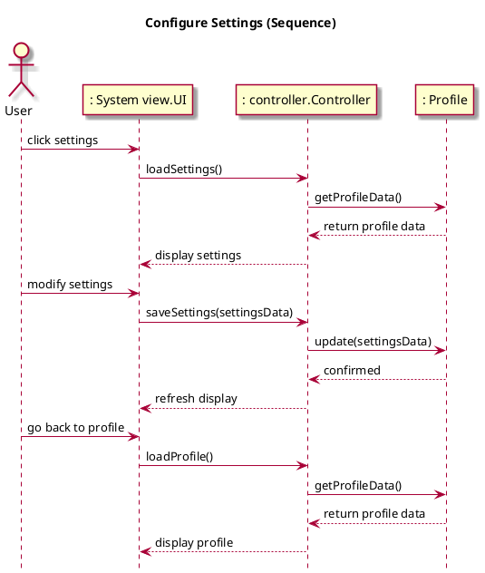

# Configure Settings

## 1. Primary actor and goals
__User__: Ease of access changing location settings, either local or global. Able to change the appearance of app through settings. Wants to view and/or change any relevant account information (i.e., profile picture, bio, etc.)

## 2. Other stakeholders and their goals
No other stakeholders

## 3. Preconditions
* User is authenticated
* User is in Profile tab.

## 4. Postconditions

* Profile/account information may be updated.
* Location information may be toggled.
* Appearance may be changed.

## 5. Workflow

## 6. Sequence Diagram
