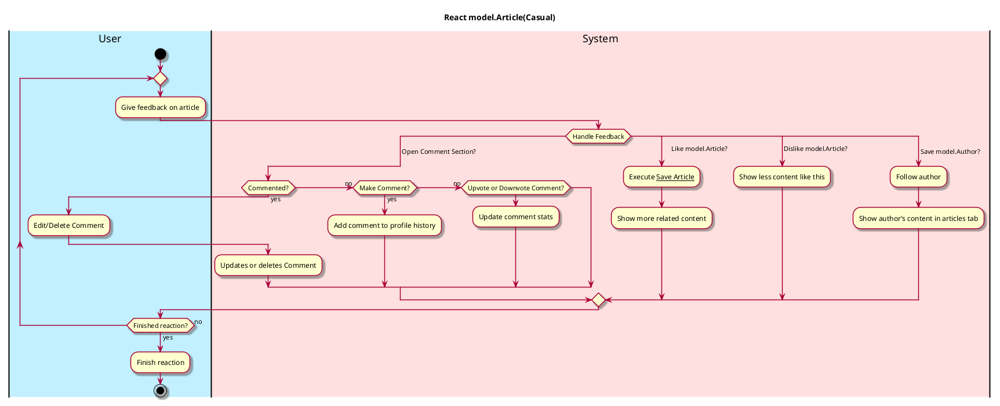
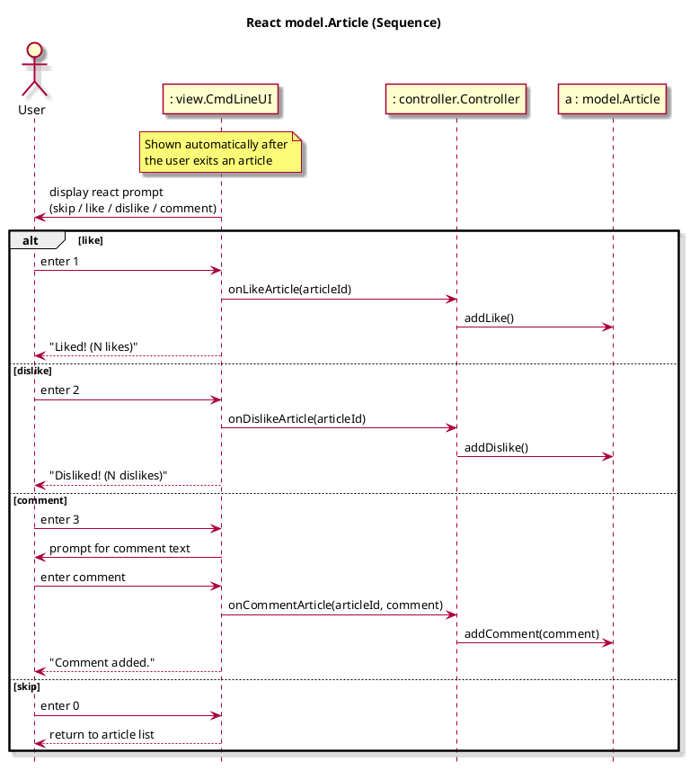

# React model.Article

## 1. Primary actor and goals

__User__: Ease of access giving feedback on article content from personal impressions and thoughts. Able to Upvote or Downvote articles based off enjoyment or other opinions. Ease of access leaving comments to any articles they have strong opinions about.

## 2. Other stakeholders and their goals

* __Websites__: Wants to know how many reactions the article has gotten for later use.
* __Author__: Wants feedback from users on their article, probably positive. Prefers likes to dislikes. Wants user to check out other articles they have written or to subscribe to their profile.

## 3. Preconditions
* User is authenticated
* User is in articles tab and clicks an article.
* User has opened and read through an article.

## 4. Postconditions
* Liked article is saved to section in profile.
* Preferences are saved, so user receives more liked content and less disliked content.
* Comment is saved to user history.
* Stats are updated in user profile.
* Displays reaction (comment or like/dislike)

## 5. Workflow

## 6. Sequence Diagram
