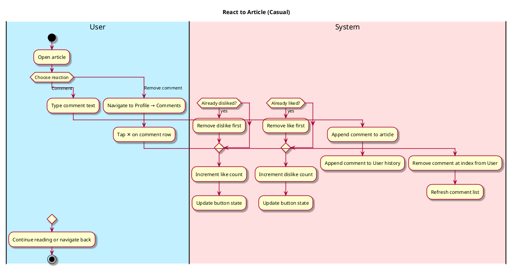
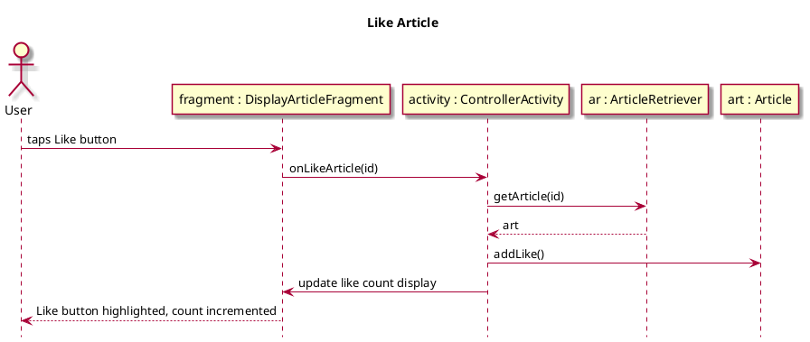
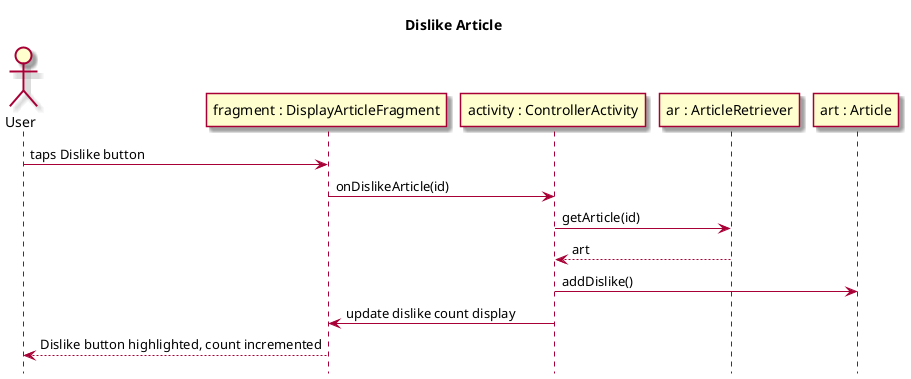
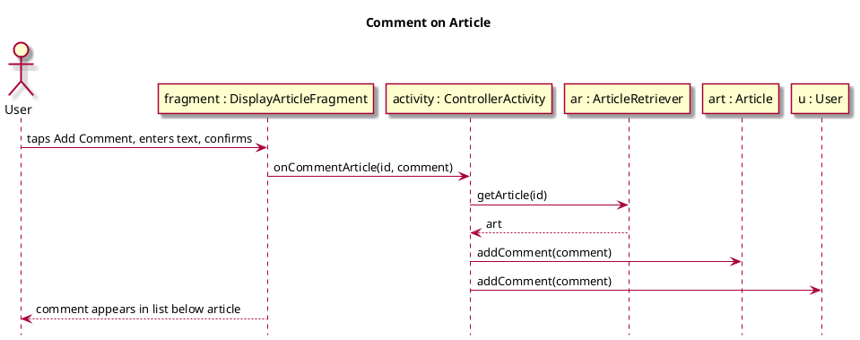
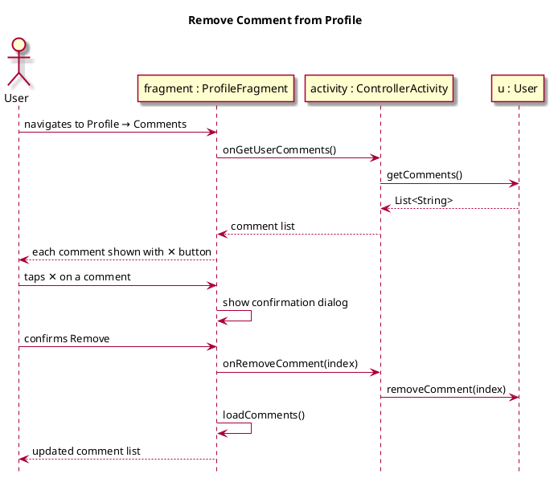

# React Article

## 1. Primary actor and goals

__User__: Wants to like, dislike, or comment on an article they have read. Likes and dislikes are mutually exclusive toggles. Comments are stored per-session and removable from the profile screen.

## 2. Other stakeholders and their goals

* __Authors__: Benefit from knowing how many users reacted positively.

## 3. Preconditions
* User has opened an article in the Display Article screen.

## 4. Postconditions
* Like/dislike count is updated (mutual exclusion enforced).
* Comment is appended to the article and to the user's comment history.
* User can remove their own comments from the Profile screen.

## 5. Workflow

## 6. Sequence Diagrams

