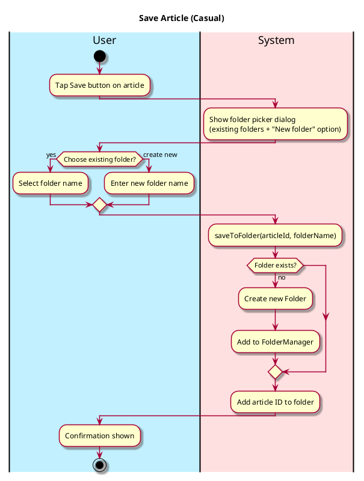
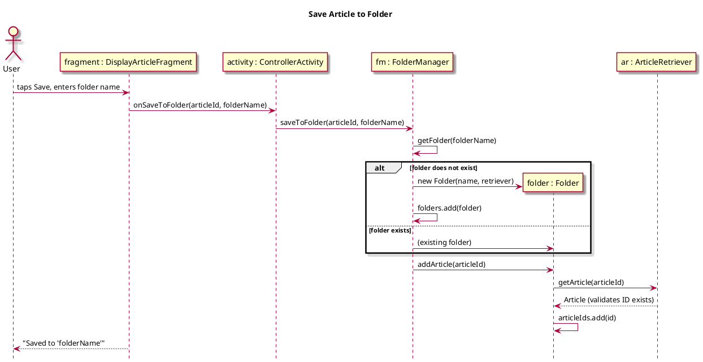
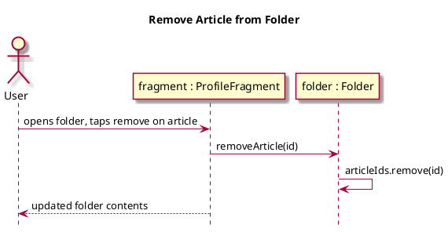

# Save Article

## 1. Primary actor and goals

__User__: Wants to save articles into named folders for later reference. Folders are created on demand and listed on the Profile screen.

## 2. Other stakeholders and their goals

* __Authors__: Benefit from knowing how many users saved their article.

## 3. Preconditions
* User has opened an article in the Display Article screen.

## 4. Postconditions
* Article is stored in the named folder (folder is created if it does not exist).
* Folder appears on the Profile screen.

## 5. Workflow

## 6. Sequence Diagrams

