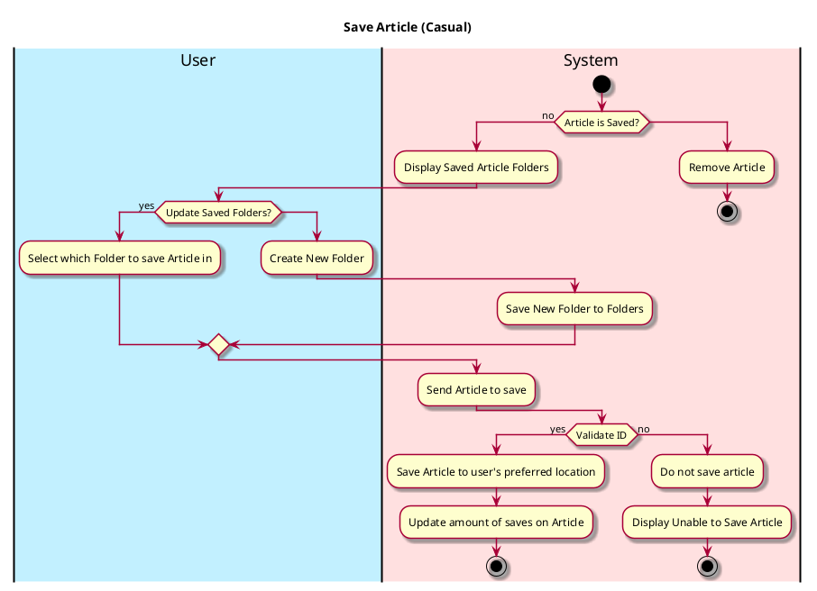
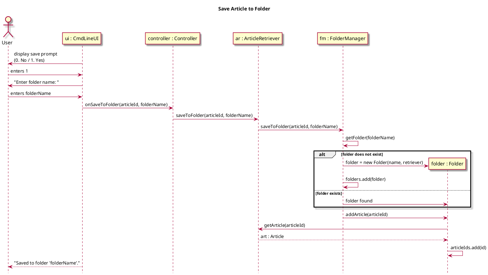
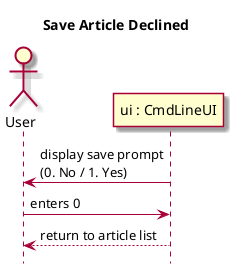
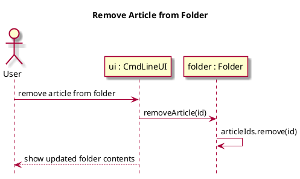

# Save Article

## 1. Primary actor and goals

__User__: Ease of access storing articles for later reading or saving them in preferred folders. 

## 2. Other stakeholders and their goals

* __Author__: Wants to know how many saves their article has gained.

## 3. Preconditions
* User is authenticated
* User switches to Article Section
* User accesses Article
* User has clicked Save Article Button

## 4. Postconditions
* Stores Article into a Saved Folder
* Author is able to view how much saves

## 5. Workflow

## 6. Sequence Diagram

