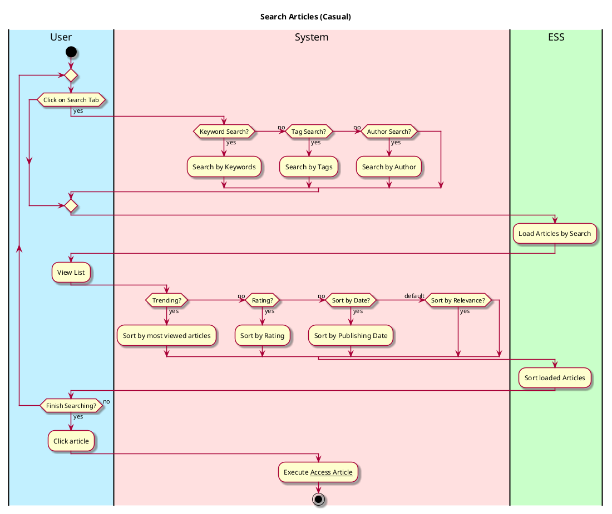
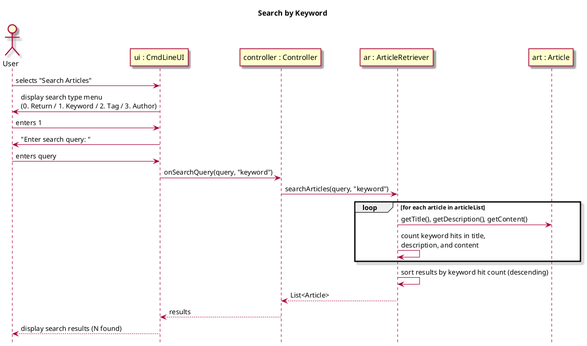
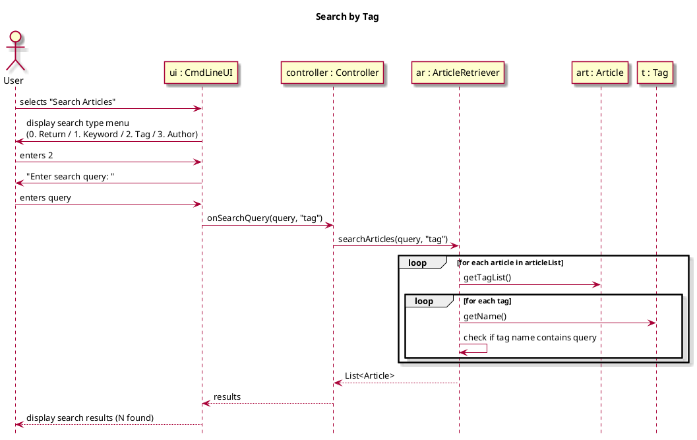
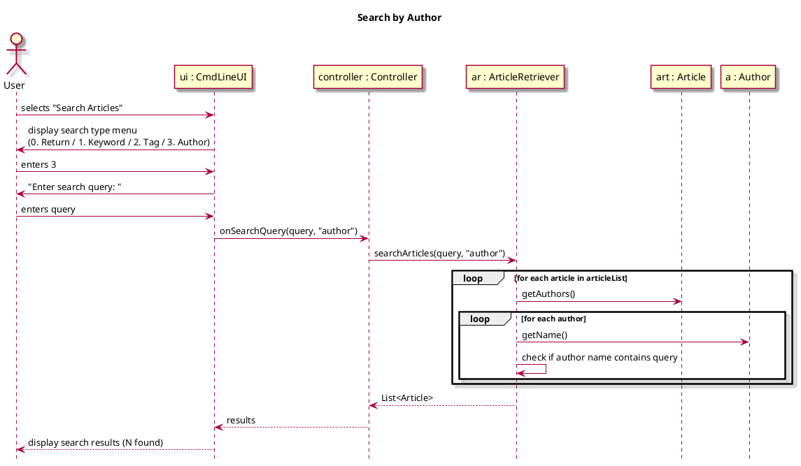
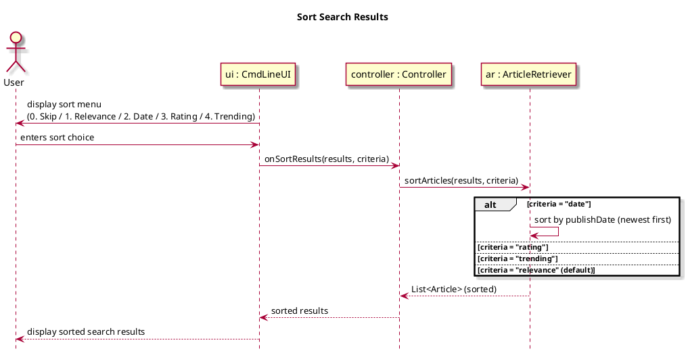
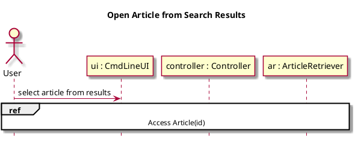

# Search Article

## 1. Primary actor and goals
__User__: Wants to look for relevant articles depending on keywords, tags, authors, or publishing year. Looking for relevant, topical news that all relate to what the user inputs and is searching for.

## 2. Other stakeholders and their goals

* __Websites__: Wants information about if their article was searched and accessed.
* __Author__: Wants information if their article was searched for.

## 3. Preconditions
* User switches to Article Section

## 4. Postconditions
* List of relevant articles are shown
* Ordered from most relevant based on relevancy from keywords

## 5. Workflow

## 6. Sequence Diagram

