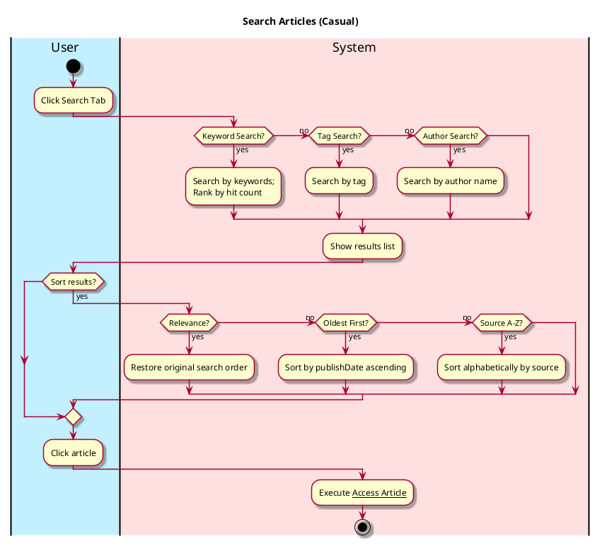
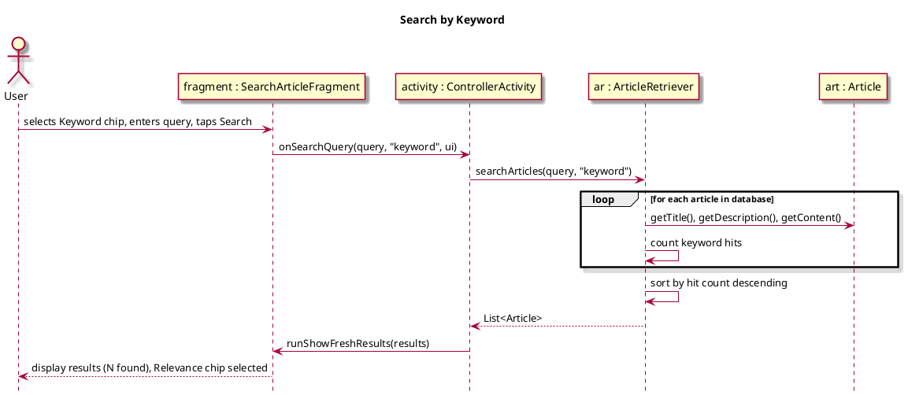
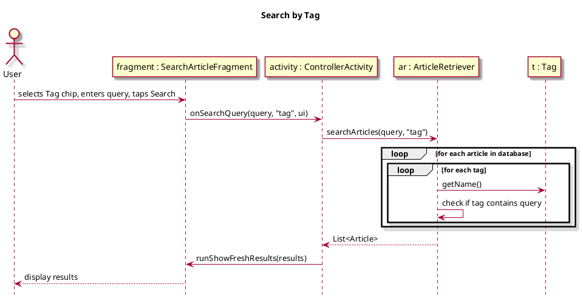
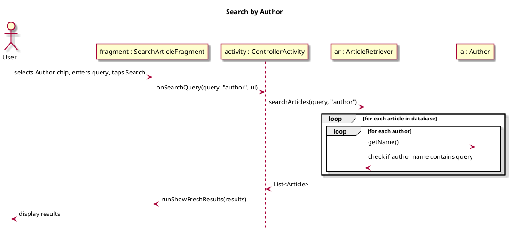
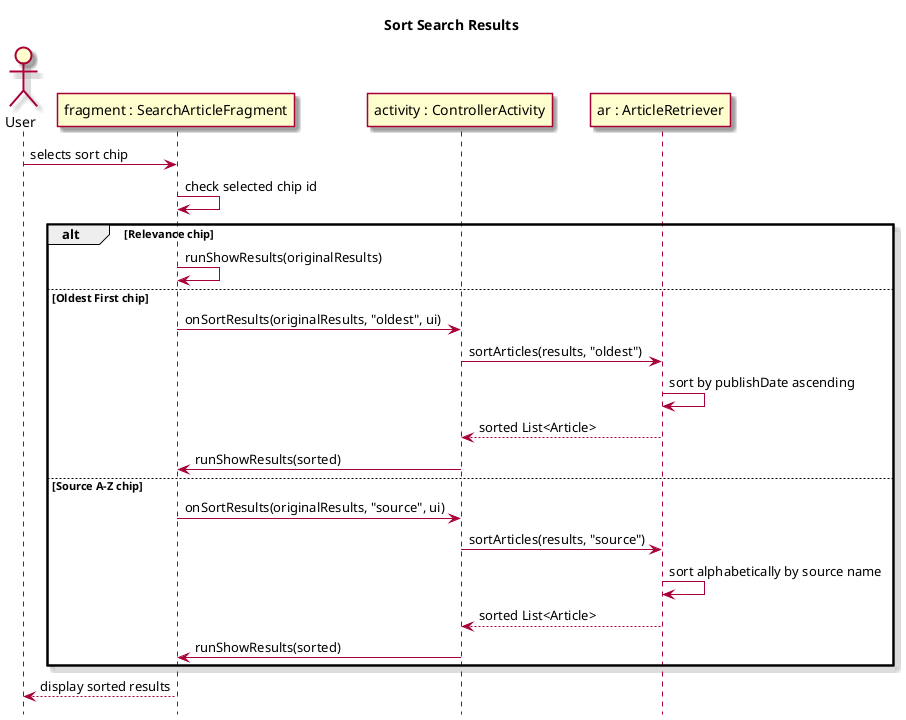
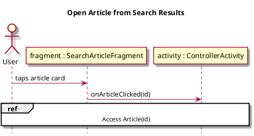

# Search Article

## 1. Primary actor and goals
__User__: Wants to find relevant environmental articles by keyword, tag, or author, and sort results in a meaningful order.

## 2. Other stakeholders and their goals

* __Websites__: Want attribution when their articles are surfaced.
* __Authors__: Want visibility when their articles are searched.

## 3. Preconditions
* User navigates to the Search tab.

## 4. Postconditions
* A list of matching articles is displayed, ordered by the selected sort criterion.

## 5. Workflow

## 6. Sequence Diagrams

