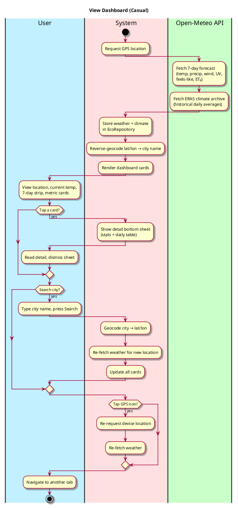
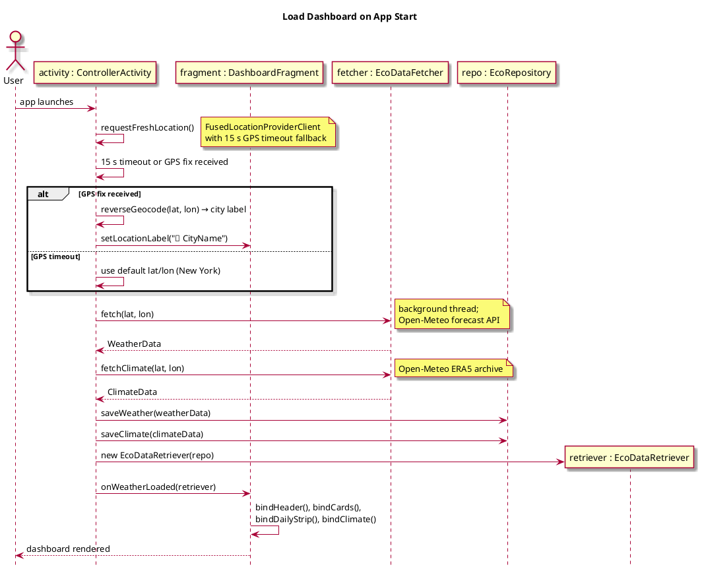
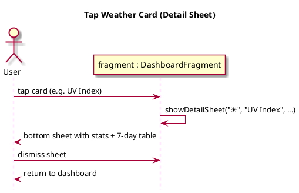
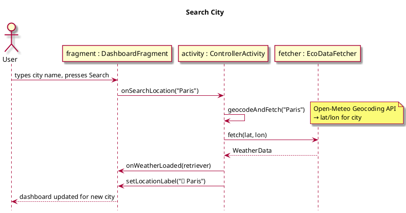

# View Eco Dashboard

## 1. Primary actor and goals

__User__: Wants a quick, local view of current weather and long-term climate signals — temperature, precipitation, wind, UV index, heat stress, and drought — to understand how climate change is affecting their area.

## 2. Other stakeholders and their goals

* __Open-Meteo__: Provides free weather and ERA5 historical climate data via JSON API.

## 3. Preconditions

* App has launched and the Dashboard tab is selected (it is the default landing screen).
* Device has internet access.
* Location permission is granted (or a GPS timeout fallback kicks in).

## 4. Postconditions

* Current conditions, 7-day forecast, and climate anomaly card are populated.
* Tapping any card opens a detail bottom sheet.
* User can search a city or refresh GPS to change the location.

## 5. Workflow

## 6. Sequence Diagrams

