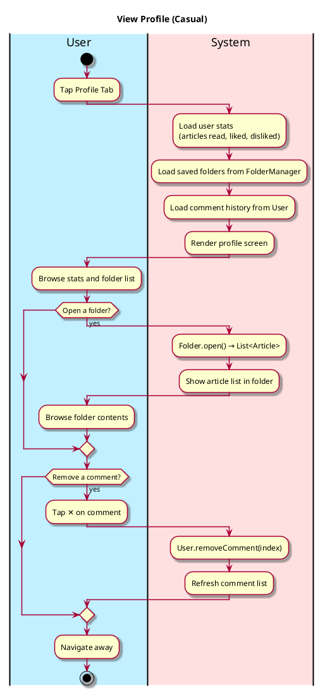
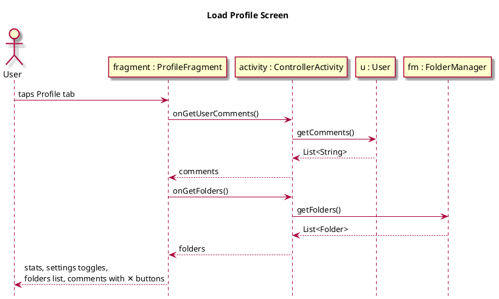
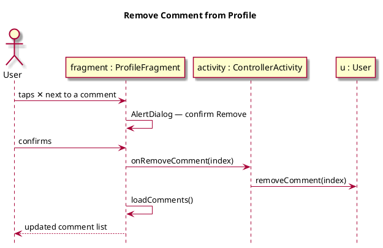

# View Profile

## 1. Primary actor and goals
__User__: Wants to review their activity stats, browse saved folders, and review or remove their comment history.

## 2. Other stakeholders and their goals
None.

## 3. Preconditions
* User taps the Profile tab.

## 4. Postconditions
* User stats (articles read, liked, disliked) are displayed.
* Saved folders list is shown with article counts.
* Comment history is shown with a remove button per entry.

## 5. Workflow

## 6. Sequence Diagrams

