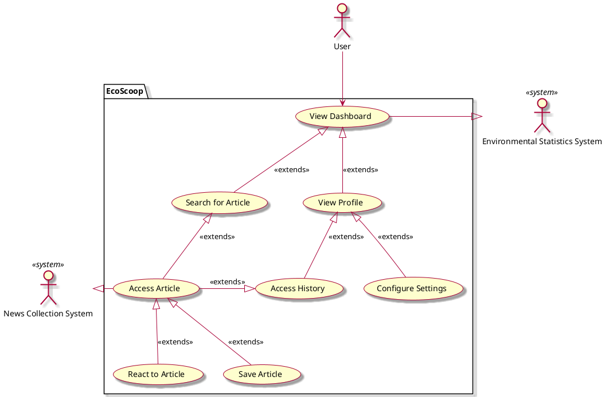

# EcoScoop - Vision Document

## 1. Introduction

We envision EcoScoop as an engaging and dynamic News Hub application, designed to deliver sustainable and environmentally-focused news with real-time updates. It will feature interactive user experiences and incorporate gamification elements to enhance user engagement and encourage regular usage.

## 2. Business case
Our News Hub application addresses customer needs that other products do not:

1. It supports user-oriented preferences and feed.
2. It provides non-biased eco-sustainable news articles and filters through false information.
3. It integrates game aspects to create a fun interactive environment.

## 3. Key functionality
- Provides Articles and News Feeds focusing on eco-sustainability.
- Multiple interactable games and features (Leaderboard, Points, Games)
- Real time crawling and article updating using third party servers
- Rating System allowing for more interaction and what is trending

## 4. Stakeholder goals summary
- **User**: Wants to have ease of access obtaining relevant articles about their specific interests on the environment, fact-based news, and a readable format.
- **Author**: Requires attribution/credit for written articles and information relating to their article (i.e, comments, reactions, saved/share).
- **Websites**: Requires attribution/credit for published articles and information relating to the articles they have published (i.e., preferred tags, keywords, reactions, saves)

## Use case diagram

