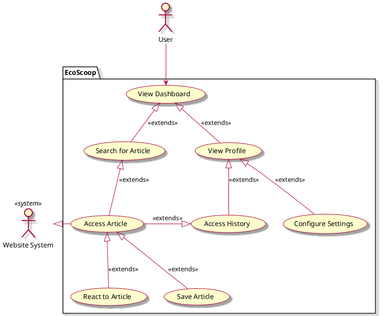

# NextGen Point Of Sale system - Vision document 

## 1. Introduction

We envision a robust News Hub application, EcoScoop, with the ability to support multiple news articles and user-based interaction, supporting a gameified feel to support usage.

## 2. Business case
Our News Hub application addresses customer needs that other products do not:

1. It supports user-oriented preferences and feed.
2. It provides non-biased eco-sustainable news articles and filters through false information.
3. It integrates game aspects to create a fun interactive environment.

## 3. Key functionality
- Provides Articles and News Feeds focusing on eco-sustainability.
- Multiple interactable games and features (Leaderboard, Points, Games)
- Real time crawling and article updating using third party servers
- Rating System allowing for more interaction and what is trending

## 4. Stakeholder goals summary
- **User**: obtain relevant articles on environment, topical news, readable format, interact with articles
- **Author**: write articles, develop news feeds,
- **Websites**: provide articles, want credit and attribution

## Use case diagram

